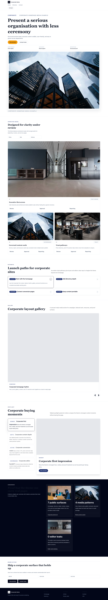
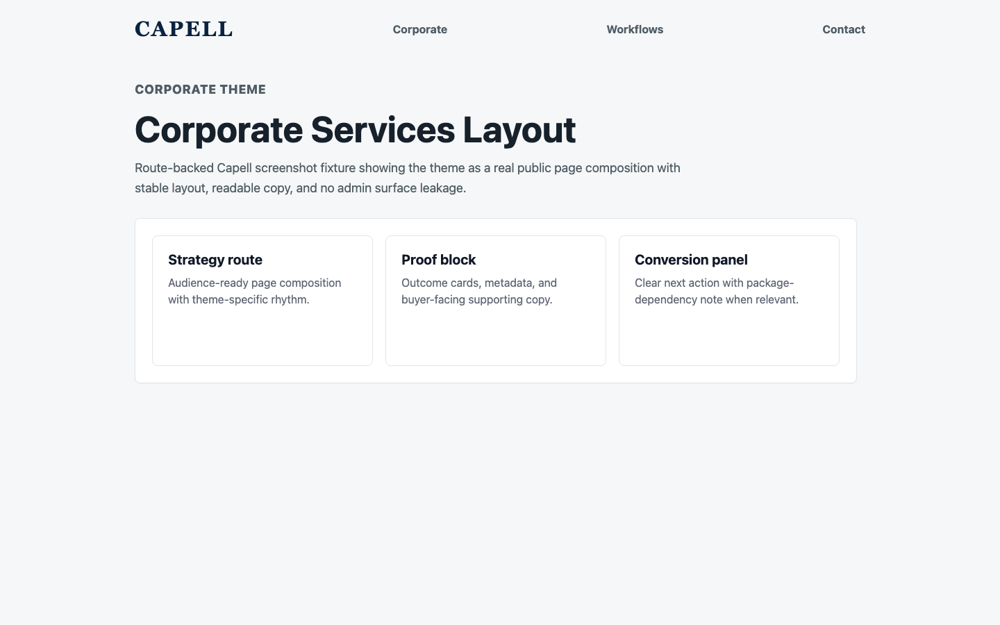
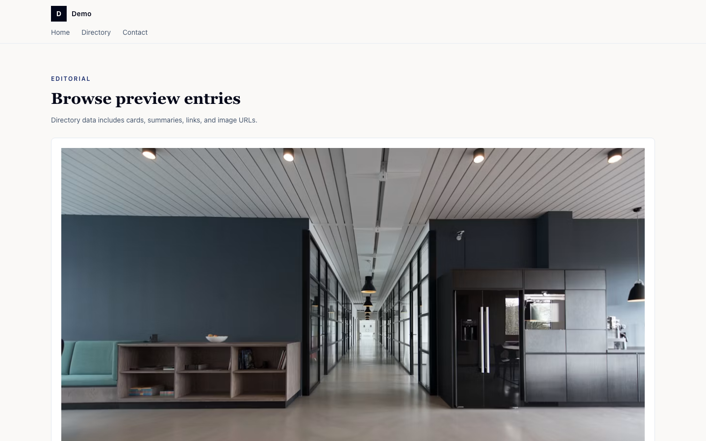
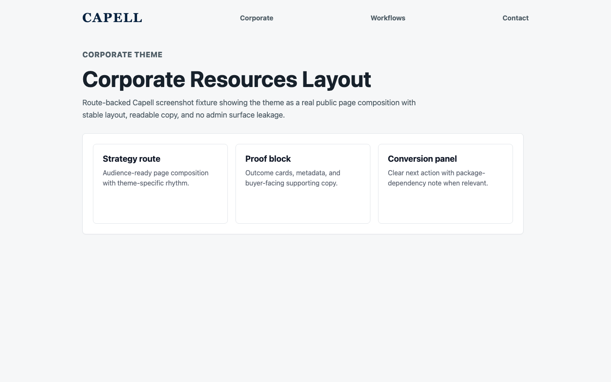
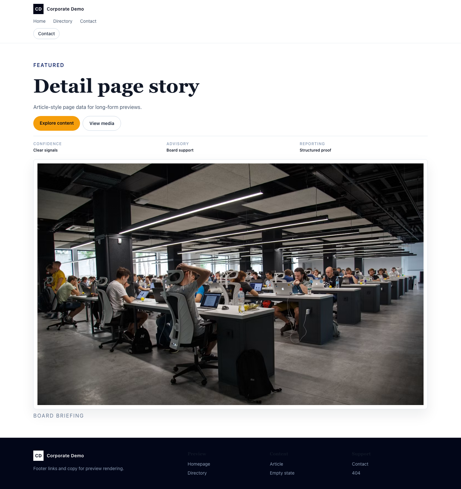
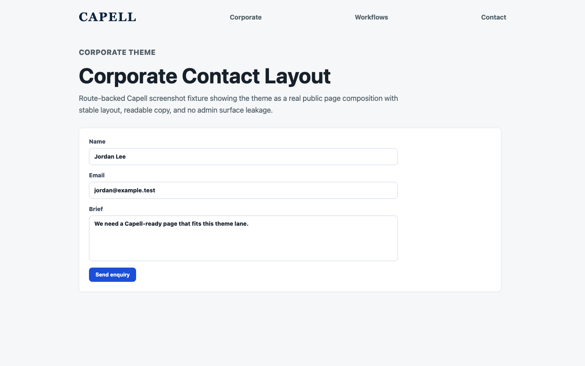
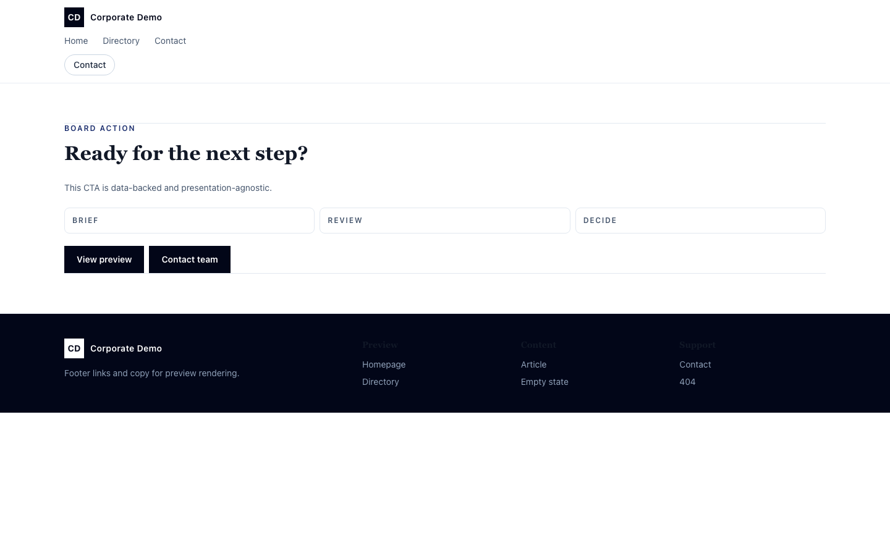

# Theme Corporate

<!-- prettier-ignore-start -->

## What This Plugin Adds

Theme Corporate is an **Available**, **No schema impact** Capell theme in the **Capell Foundation** product group. It ships as `capell-app/theme-corporate` and extends these surfaces: frontend.

Theme Corporate gives established businesses, advisory firms, and public bodies a polished, credibility-first site without a design project. Six curated presets - Boardroom, Civic, Advisory, Integrity, Enterprise Trust, and Public Ledger - span deep-navy formal through accessible civic and editorial advisory looks, each tuned for clarity and contrast. Structured proof carousels, capability bands, and a measured content hierarchy are built to read as authoritative on desktop and mobile alike, with full dark-mode support. Drop it on any Capell site, run the one-command demo, and pick a preset.

After install, admins can select the theme through the core theme management surface. Editors keep using normal Capell content workflows while the package controls public presentation.

Status details:

- Status: Available
- Tier: free
- Bundle: foundation
- Composer package: `capell-app/theme-corporate`
- Namespace: `Capell\ThemeStudio\Corporate`
- Theme key: `corporate`

## Why It Matters

**For developers:** The package gives developers package-owned service providers, Actions, and Blade views instead of pushing this behaviour into core or application code.

**For teams:** A restrained, trust-led website theme for B2B, professional-services, and public-sector organisations - formal hierarchy, board-grade proof blocks, and six palette presets out of the box.

## Screens And Workflow

Screenshot contract: `screenshots.json`.

- Frontend page rendered with Corporate theme (frontend, optional).
- Corporate homepage (frontend, optional).
- Services page (frontend, optional).
- Governance page (frontend, optional).
- Resources listing (frontend, optional).
- Thought leadership article (frontend, optional).
- Contact form page (frontend, optional).
- Locations page (frontend, optional).
- Search results page (frontend, optional).
- Event detail page (frontend, optional).

## Screenshot Evidence

These captures are the package-owned visual contract for the admin pages, public pages, actions, workflows, and feature surfaces described above. Keep this section aligned with `docs/screenshots.json` whenever the package surface changes.

### Frontend page rendered with Corporate theme

- Surface: frontend · Target: /theme-corporate.
- Documents: A visitor sees a seeded public page rendered through every Corporate theme section.
- Capture notes: Capture the seeded package theme route instead of the shared theme-gallery route. Optional until the Capell runner can browser-capture seeded package theme routes without navigation failures.

### Corporate homepage

- Surface: frontend · Target: /theme-corporate.
- Documents: A business team reviews Corporate as a polished basic preset for board papers and formal service sites.
- Capture notes: Capture the seeded package theme route instead of the shared theme-gallery route. Optional until the Capell runner can browser-capture seeded package theme routes without navigation failures.

### Services page

- Surface: frontend · Target: /theme-corporate-directory.
- Documents: A business buyer checks that services read as boardroom-ready rather than SaaS features or local job cards.
- Capture notes: Capture the seeded package theme route instead of the shared theme-gallery route. Optional until the Capell runner can browser-capture seeded package theme routes without navigation failures.

### Governance page

- Surface: frontend · Target: /theme-corporate-directory.
- Documents: A corporate team can publish formal decision material without the theme pretending to be a premium enterprise workflow.
- Capture notes: Capture the seeded package theme route instead of the shared theme-gallery route. Optional until the Capell runner can browser-capture seeded package theme routes without navigation failures.

### Resources listing

- Surface: frontend · Target: /theme-corporate-directory.
- Documents: A visitor can browse formal resources without the page becoming Knowledge's research archive.
- Capture notes: Capture the seeded package theme route instead of the shared theme-gallery route. Optional until the Capell runner can browser-capture seeded package theme routes without navigation failures.

### Thought leadership article

- Surface: frontend · Target: /theme-corporate-detail.
- Documents: A business site can publish leadership material while keeping a restrained corporate rhythm.
- Capture notes: Capture the seeded package theme route instead of the shared theme-gallery route. Optional until the Capell runner can browser-capture seeded package theme routes without navigation failures.

### Contact form page

- Surface: frontend · Target: /theme-corporate-contact.
- Documents: A business team checks that enquiries route cleanly without becoming a broad lead-generation page.
- Capture notes: Capture the seeded package theme route instead of the shared theme-gallery route. Optional until the Capell runner can browser-capture seeded package theme routes without navigation failures.

### Locations page

- Surface: frontend · Target: /theme-corporate-directory.
- Documents: A formal organisation can show locations and contact routes without local-services styling.
- Capture notes: Capture the seeded package theme route instead of the shared theme-gallery route. Optional until the Capell runner can browser-capture seeded package theme routes without navigation failures.

### Search results page

- Surface: frontend · Target: /theme-corporate-directory.
- Documents: A visitor can find corporate material without the page looking like product search or an editorial archive.
- Capture notes: Capture the seeded package theme route instead of the shared theme-gallery route. Optional until the Capell runner can browser-capture seeded package theme routes without navigation failures.

### Event detail page

- Surface: frontend · Target: /theme-corporate-cta.
- Documents: A corporate team can publish stakeholder events without overlapping SaaS webinars or nonprofit community events.
- Capture notes: Capture the seeded package theme route instead of the shared theme-gallery route. Optional until the Capell runner can browser-capture seeded package theme routes without navigation failures.

## Technical Shape

- Service providers: `Capell\ThemeStudio\Corporate\CorporateThemeServiceProvider`.
- Actions: `InstallCorporateThemeDemoAction`.
- Command signatures: `capell:theme-corporate-demo`.
- Console command classes: `DemoCommand`.
- Manifest contributions: `admin-page: Capell\ThemeStudio\Corporate\Manifest\ThemeManagementPageContribution`.
- Health checks: `Capell\ThemeStudio\Corporate\Health\ThemeCorporateHealthCheck`.
- Blade views: `packages/theme-corporate/resources/views/livewire/page/page.blade.php`, `packages/theme-corporate/resources/views/page.blade.php`, `packages/theme-corporate/resources/views/sections/careers.blade.php`, `packages/theme-corporate/resources/views/sections/content-listing.blade.php`, `packages/theme-corporate/resources/views/sections/cta.blade.php`, `packages/theme-corporate/resources/views/sections/features.blade.php`, `packages/theme-corporate/resources/views/sections/footer.blade.php`, `packages/theme-corporate/resources/views/sections/hero.blade.php`, `packages/theme-corporate/resources/views/sections/investor-relations.blade.php`, `packages/theme-corporate/resources/views/sections/locations.blade.php`, `packages/theme-corporate/resources/views/sections/navigation.blade.php`, `packages/theme-corporate/resources/views/sections/proof.blade.php`.
- Cache tags: `theme-corporate`.

## Data Model

This theme has no schema impact. It relies on core Capell site, page, locale, and theme records instead of declaring package-owned tables.

## Install Impact

- Admin navigation: contributes admin extension points through `capell.json`.
- Permissions: none declared in `capell.json`.
- Public routes: none detected in package route files.
- Database changes: no package migrations declared.
- Settings: no package settings declared.
- Queues or schedules: none detected in standard package paths.
- Cache tags: `theme-corporate`.
- Commands: `capell:theme-corporate-demo`.

## Common Pitfalls

- Keep public Blade and cached HTML free of authoring markers, model IDs, permissions, signed editor URLs, and lazy database queries.
- Keep `composer.json`, `composer.local.json`, `capell.json`, docs, screenshots, and tests aligned when the package surface changes.

## Troubleshooting

| Symptom | Likely cause | Check | Fix |
| --- | --- | --- | --- |
| Package surface is missing after install | Provider or manifest is not loaded | Confirm `capell.json`, package `composer.json`, and provider registration | Reinstall the package, refresh Composer autoload, and clear host caches |
| Background work does not run | Queue worker or scheduled command is not active | Check package jobs, commands, and host scheduler configuration | Start the queue or scheduler, then run the focused command or package test |
| Public output leaks unexpected state | Render data, cache variation, or authoring boundary has regressed | Check public Blade, cache tags, and public-output safety tests | Move data loading out of Blade and rerun the package public-output tests |

## Quick Start

1. Install the package: `composer require capell-app/theme-corporate`.
2. Run the required setup: `php artisan capell:theme-corporate-demo`.
3. Verify the package provider is registered and the related frontend, command, or extension point is active.

## Next Steps

- [Package docs index](README.md)
- [Screenshot contract](screenshots.json)
- [Marketplace assets](assets/marketplace/)
- [Capell content language plan](../../../docs/CONTENT_LANGUAGE_PLAN.md)
- [Capell documentation design system](../../../docs/DESIGN_SYSTEM.md)
- [Capell and package ERD notes](../../../docs/erd/capell-and-package-erds.md)
- Focused tests: `vendor/bin/pest packages/theme-corporate/tests --configuration=phpunit.xml`.

<!-- prettier-ignore-end -->
