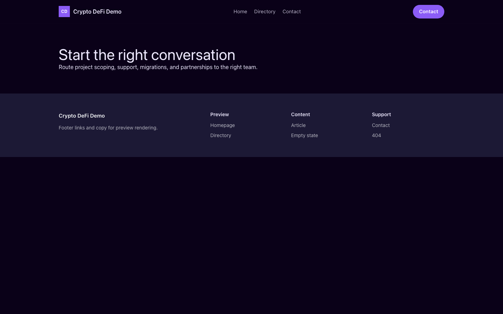

# Theme Crypto DeFi

Crypto DeFi provides a distinct Capell frontend theme for Helix Protocol. From the repository root, run `vendor/bin/pest packages/theme-crypto-defi/tests`; this package does not ship its own PHPUnit config.

## Screenshot Evidence

These captures are the package-owned visual contract for the admin pages, public pages, actions, workflows, and feature surfaces described above. Keep this section aligned with `docs/screenshots.json` whenever the package surface changes.

### Crypto DeFi Homepage

- Surface: frontend · Target: /.
- Documents: Theme marketplace preview.
- Capture notes: Crypto DeFi Homepage.

### Crypto DeFi Landing page

- Surface: frontend · Target: /.
- Documents: Theme marketplace preview.
- Capture notes: Crypto DeFi Landing page.

### Crypto DeFi List page

- Surface: frontend · Target: /.
- Documents: Theme marketplace preview.
- Capture notes: Crypto DeFi List page.

### Crypto DeFi Search results

- Surface: frontend · Target: /.
- Documents: Theme marketplace preview.
- Capture notes: Crypto DeFi Search results.

### Crypto DeFi Contact form

- Surface: frontend · Target: /.
- Documents: Theme marketplace preview.
- Capture notes: Crypto DeFi Contact form.
