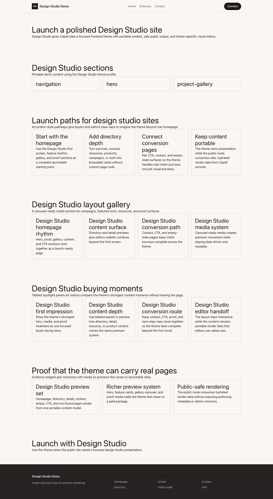

# Theme Design Studio

Design Studio provides a distinct Capell frontend theme for Atelier Norð. From the repository root, run `vendor/bin/pest packages/theme-design-studio/tests`; this package does not ship its own PHPUnit config.

## Screenshot Evidence

These captures are the package-owned visual contract for the admin pages, public pages, actions, workflows, and feature surfaces described above. Keep this section aligned with `docs/screenshots.json` whenever the package surface changes.

### Design Studio Homepage

- Surface: frontend · Target: /.
- Documents: Theme marketplace preview.
- Capture notes: Design Studio Homepage.

### Design Studio Landing page

- Surface: frontend · Target: /.
- Documents: Theme marketplace preview.
- Capture notes: Design Studio Landing page.

### Design Studio List page

- Surface: frontend · Target: /.
- Documents: Theme marketplace preview.
- Capture notes: Design Studio List page.

### Design Studio Search results

- Surface: frontend · Target: /.
- Documents: Theme marketplace preview.
- Capture notes: Design Studio Search results.

### Design Studio Contact form

- Surface: frontend · Target: /.
- Documents: Theme marketplace preview.
- Capture notes: Design Studio Contact form.
