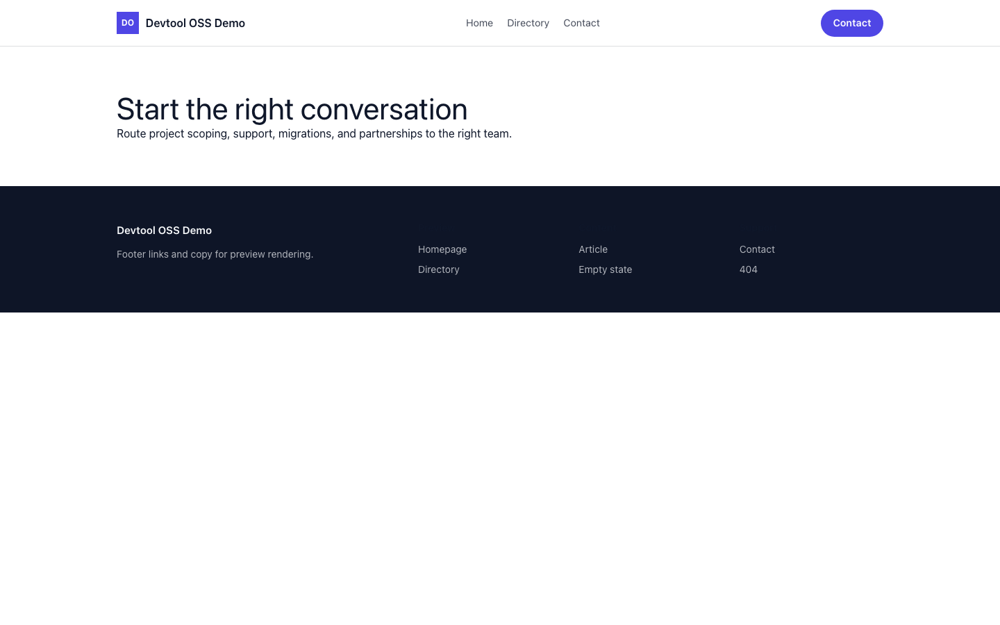

# Theme Devtool OSS

Devtool OSS provides a distinct Capell frontend theme for Scheduler OSS. From the repository root, run `vendor/bin/pest packages/theme-devtool-oss/tests`; this package does not ship its own PHPUnit config.

## Screenshot Evidence

These captures are the package-owned visual contract for the admin pages, public pages, actions, workflows, and feature surfaces described above. Keep this section aligned with `docs/screenshots.json` whenever the package surface changes.

### Devtool OSS Homepage

- Surface: frontend · Target: /.
- Documents: Theme marketplace preview.
- Capture notes: Devtool OSS Homepage.

### Devtool OSS Landing page

- Surface: frontend · Target: /.
- Documents: Theme marketplace preview.
- Capture notes: Devtool OSS Landing page.

### Devtool OSS List page

- Surface: frontend · Target: /.
- Documents: Theme marketplace preview.
- Capture notes: Devtool OSS List page.

### Devtool OSS Search results

- Surface: frontend · Target: /.
- Documents: Theme marketplace preview.
- Capture notes: Devtool OSS Search results.

### Devtool OSS Contact form

- Surface: frontend · Target: /.
- Documents: Theme marketplace preview.
- Capture notes: Devtool OSS Contact form.
