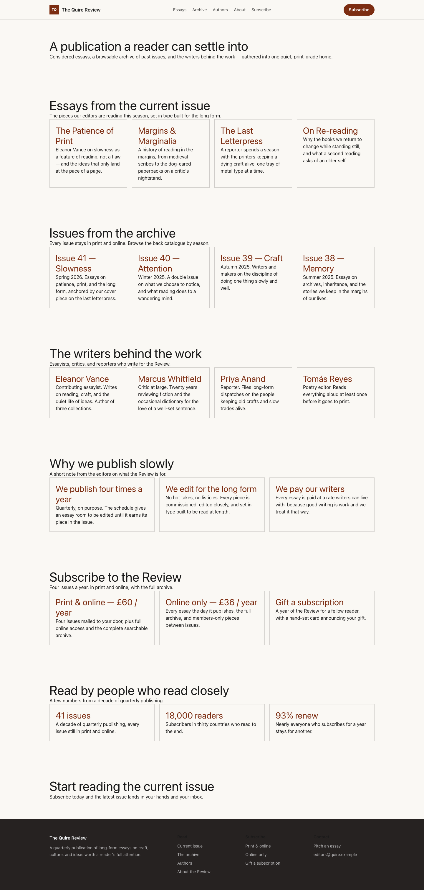

# Theme Editorial Serif

Editorial Serif provides a distinct Capell frontend theme for Quarter Press. From the repository root, run `vendor/bin/pest packages/theme-editorial-serif/tests`; this package does not ship its own PHPUnit config.

## Screenshot Evidence

These captures are the package-owned visual contract for the admin pages, public pages, actions, workflows, and feature surfaces described above. Keep this section aligned with `docs/screenshots.json` whenever the package surface changes.

### Editorial Serif Homepage

- Surface: frontend · Target: /.
- Documents: Theme marketplace preview.
- Capture notes: Editorial Serif Homepage.

### Editorial Serif Landing page

- Surface: frontend · Target: /.
- Documents: Theme marketplace preview.
- Capture notes: Editorial Serif Landing page.

### Editorial Serif List page

- Surface: frontend · Target: /.
- Documents: Theme marketplace preview.
- Capture notes: Editorial Serif List page.

### Editorial Serif Search results

- Surface: frontend · Target: /.
- Documents: Theme marketplace preview.
- Capture notes: Editorial Serif Search results.

### Editorial Serif Contact form

- Surface: frontend · Target: /.
- Documents: Theme marketplace preview.
- Capture notes: Editorial Serif Contact form.
