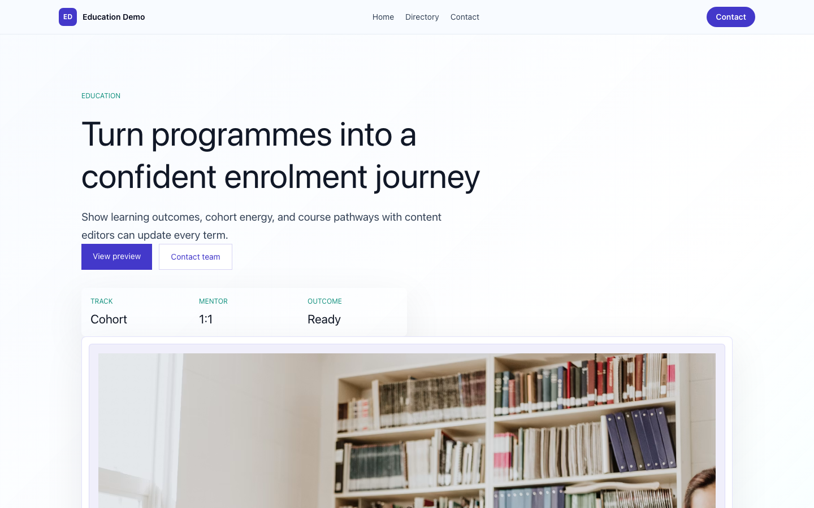
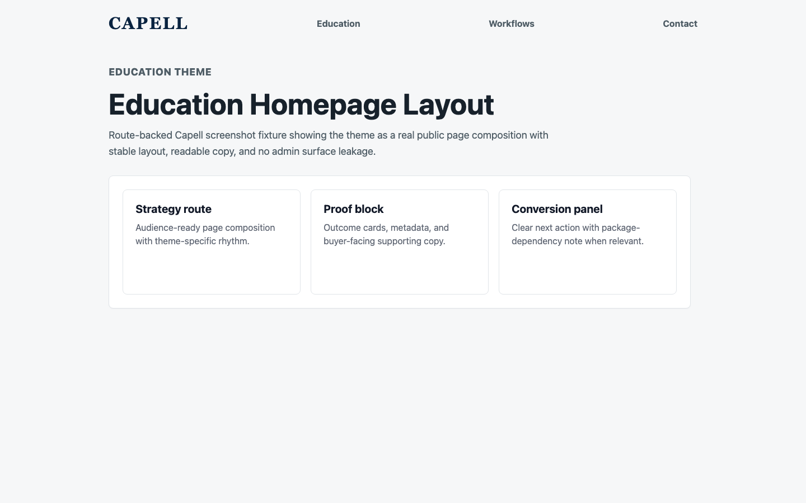
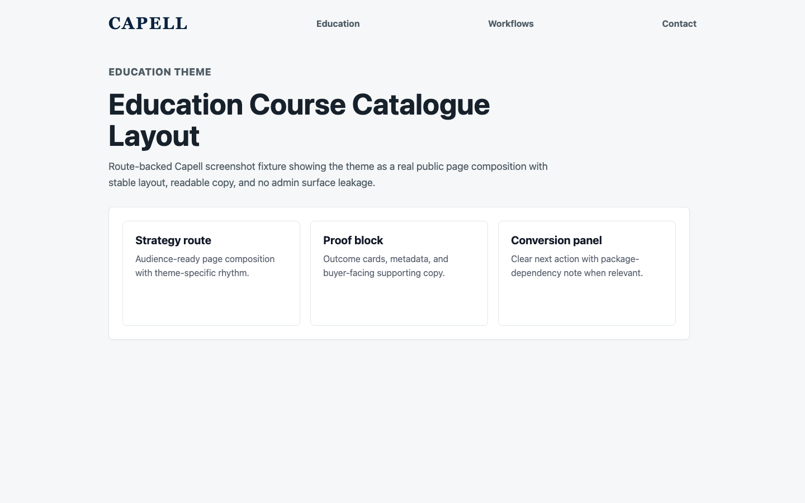
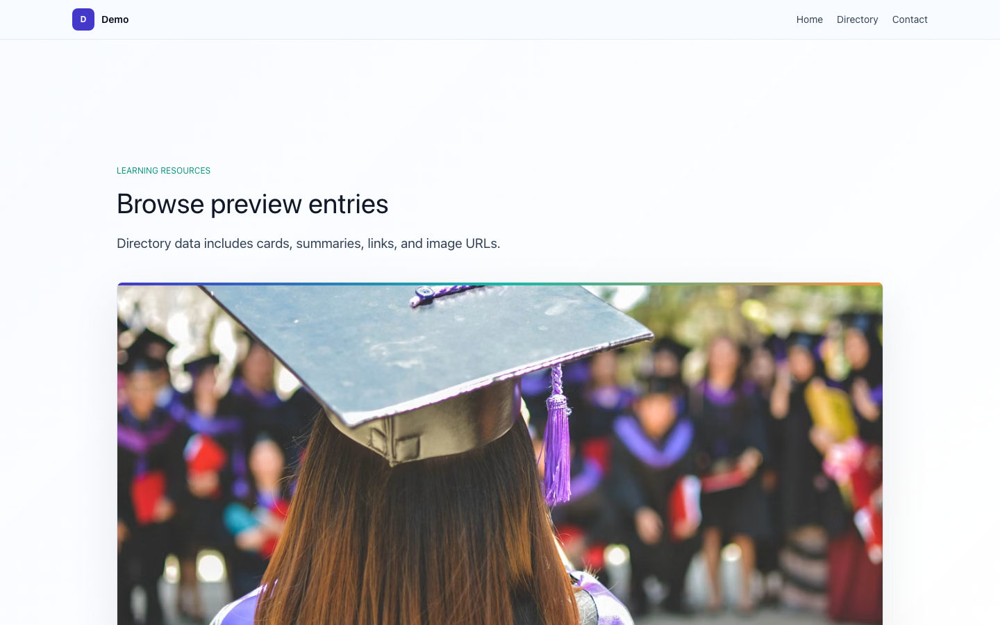
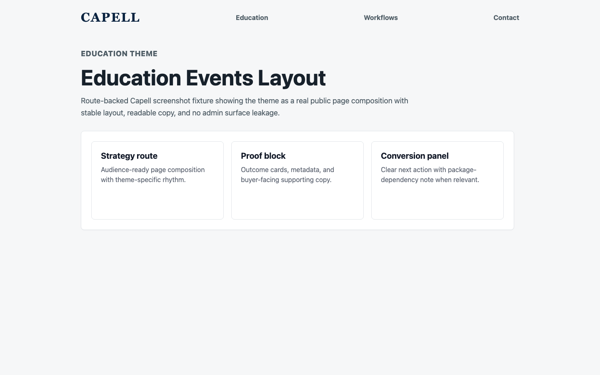
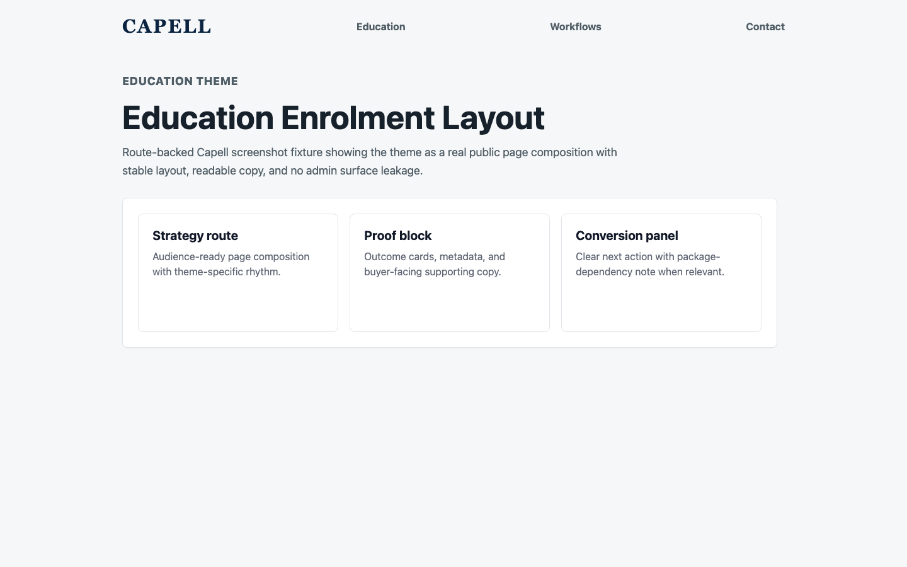

# Theme Education

<!-- prettier-ignore-start -->

## What This Plugin Adds

Theme Education is an **Available**, **No schema impact** Capell theme in the **Capell Themes** product group. It ships as `capell-app/theme-education` and extends these surfaces: frontend, console.

Course and school theme for education providers, training teams, and learning programmes.

After install, admins can select the theme through the core theme management surface. Editors keep using normal Capell content workflows while the package controls public presentation.

Status details:

- Status: Available
- Tier: premium
- Bundle: themes
- Composer package: `capell-app/theme-education`
- Namespace: `Capell\ThemeStudio\Education`
- Theme key: `education`

## Why It Matters

**For developers:** The package gives developers package-owned service providers, Actions, and Blade views instead of pushing this behaviour into core or application code.

**For teams:** A polished, course-first theme for schools, academies, and training providers - turning programme discovery, faculty trust, open days, and enrolment into one coherent learner journey.

## Screens And Workflow

Screenshot contract: `screenshots.json`.

- Frontend page rendered with Education theme (frontend, optional).
- Education homepage (frontend, optional).
- Course catalogue (frontend, optional).
- Instructor and mentor profiles (frontend, optional).
- Open days and workshops (frontend, optional).
- Enrolment CTA (frontend, optional).
- Learning resources (frontend, optional).

## Screenshot Evidence

These captures are the package-owned visual contract for the admin pages, public pages, actions, workflows, and feature surfaces described above. Keep this section aligned with `docs/screenshots.json` whenever the package surface changes.

### Frontend page rendered with Education theme

- Surface: frontend · Target: /theme-education.
- Documents: A course provider sees how the theme connects discovery, trust, and enrolment in one public page.
- Capture notes: Capture the seeded package theme route instead of the shared theme-gallery route. Optional until the Capell runner can browser-capture seeded package theme routes without navigation failures.

### Education homepage

- Surface: frontend · Target: /theme-education.
- Documents: A school, academy, or training provider reviews the first-viewport learning journey before activating the theme.
- Capture notes: Capture the seeded package theme route instead of the shared theme-gallery route. Optional until the Capell runner can browser-capture seeded package theme routes without navigation failures.

### Course catalogue

- Surface: frontend · Target: /theme-education-directory.
- Documents: A learner compares course paths without the page feeling like a plain resource grid.
- Capture notes: Capture the seeded package theme route instead of the shared theme-gallery route. Optional until the Capell runner can browser-capture seeded package theme routes without navigation failures.

### Instructor and mentor profiles

- Surface: frontend · Target: /theme-education-directory.
- Documents: A learner or parent can see who teaches the programme and why the team is credible.
- Capture notes: Capture the seeded package theme route instead of the shared theme-gallery route. Optional until the Capell runner can browser-capture seeded package theme routes without navigation failures.

### Open days and workshops

- Surface: frontend · Target: /theme-education-cta.
- Documents: A school can promote open days, workshops, and cohort deadlines without custom Blade.
- Capture notes: Capture the seeded package theme route instead of the shared theme-gallery route. Optional until the Capell runner can browser-capture seeded package theme routes without navigation failures.

### Enrolment CTA

- Surface: frontend · Target: /theme-education-cta.
- Documents: A training provider checks that the theme turns course interest into a confident application route.
- Capture notes: Capture the seeded package theme route instead of the shared theme-gallery route. Optional until the Capell runner can browser-capture seeded package theme routes without navigation failures.

### Learning resources

- Surface: frontend · Target: /theme-education-directory.
- Documents: A course provider reviews how support material stays tied to learning pathways instead of becoming a plain blog.
- Capture notes: Capture the seeded package theme route instead of the shared theme-gallery route. Optional until the Capell runner can browser-capture seeded package theme routes without navigation failures.

## Technical Shape

- Service providers: `Capell\ThemeStudio\Education\EducationThemeServiceProvider`.
- Actions: `InstallEducationThemeDemoAction`, `RebalanceEducationThemeDemoPagesAction`.
- Command signatures: `capell:theme-education-demo`.
- Console command classes: `DemoCommand`.
- Manifest contributions: `admin-page: Capell\ThemeStudio\Education\Manifest\ThemeManagementPageContribution`.
- Health checks: `Capell\ThemeStudio\Education\Health\ThemeEducationHealthCheck`.
- Blade views: `packages/theme-education/resources/views/page.blade.php`, `packages/theme-education/resources/views/sections/admissions-checklist.blade.php`, `packages/theme-education/resources/views/sections/admissions-funnel.blade.php`, `packages/theme-education/resources/views/sections/content-listing.blade.php`, `packages/theme-education/resources/views/sections/course-catalog.blade.php`, `packages/theme-education/resources/views/sections/course-detail.blade.php`, `packages/theme-education/resources/views/sections/cta.blade.php`, `packages/theme-education/resources/views/sections/enrolment-cta.blade.php`, `packages/theme-education/resources/views/sections/events.blade.php`, `packages/theme-education/resources/views/sections/faculty-directory.blade.php`, `packages/theme-education/resources/views/sections/faq.blade.php`, `packages/theme-education/resources/views/sections/features.blade.php`, `and 6 more`.
- Cache tags: `theme-education`.

## Data Model

This theme has no schema impact. It relies on core Capell site, page, locale, and theme records instead of declaring package-owned tables.

## Install Impact

- Admin navigation: contributes admin extension points through `capell.json`.
- Permissions: none declared in `capell.json`.
- Public routes: none detected in package route files.
- Database changes: no package migrations declared.
- Settings: no package settings declared.
- Queues or schedules: none detected in standard package paths.
- Cache tags: `theme-education`.
- Commands: `capell:theme-education-demo`.

## Common Pitfalls

- Keep public Blade and cached HTML free of authoring markers, model IDs, permissions, signed editor URLs, and lazy database queries.
- Run package commands from the host app; in this repository use `vendor/bin/pest` for package tests.
- Keep `composer.json`, `composer.local.json`, `capell.json`, docs, screenshots, and tests aligned when the package surface changes.

## Troubleshooting

| Symptom | Likely cause | Check | Fix |
| --- | --- | --- | --- |
| Package surface is missing after install | Provider or manifest is not loaded | Confirm `capell.json`, package `composer.json`, and provider registration | Reinstall the package, refresh Composer autoload, and clear host caches |
| Background work does not run | Queue worker or scheduled command is not active | Check package jobs, commands, and host scheduler configuration | Start the queue or scheduler, then run the focused command or package test |
| Public output leaks unexpected state | Render data, cache variation, or authoring boundary has regressed | Check public Blade, cache tags, and public-output safety tests | Move data loading out of Blade and rerun the package public-output tests |

## Quick Start

1. Install the package: `composer require capell-app/theme-education`.
2. Run the required setup: `php artisan capell:theme-education-demo`.
3. Verify the package provider is registered and the related frontend, command, or extension point is active.

## Next Steps

- [Package docs index](README.md)
- [Screenshot contract](screenshots.json)
- [Marketplace assets](assets/marketplace/)
- [Capell content language plan](../../../docs/CONTENT_LANGUAGE_PLAN.md)
- [Capell documentation design system](../../../docs/DESIGN_SYSTEM.md)
- [Capell and package ERD notes](../../../docs/erd/capell-and-package-erds.md)
- Related packages: [Access Gate](../../access-gate/README.md), [Blog](../../blog/README.md), [Bookings](../../bookings/README.md), [Customer Portal](../../customer-portal/README.md), [Events](../../events/README.md), [Frontend Authoring](../../frontend-authoring/README.md), [Form Builder](../../form-builder/README.md), [Layout Builder](../../layout-builder/README.md), [Payments](../../payments/README.md), [Publishing Studio](../../publishing-studio/README.md), [Seo Suite](../../seo-suite/README.md).
- Focused tests: `vendor/bin/pest packages/theme-education/tests --configuration=phpunit.xml`.

<!-- prettier-ignore-end -->
