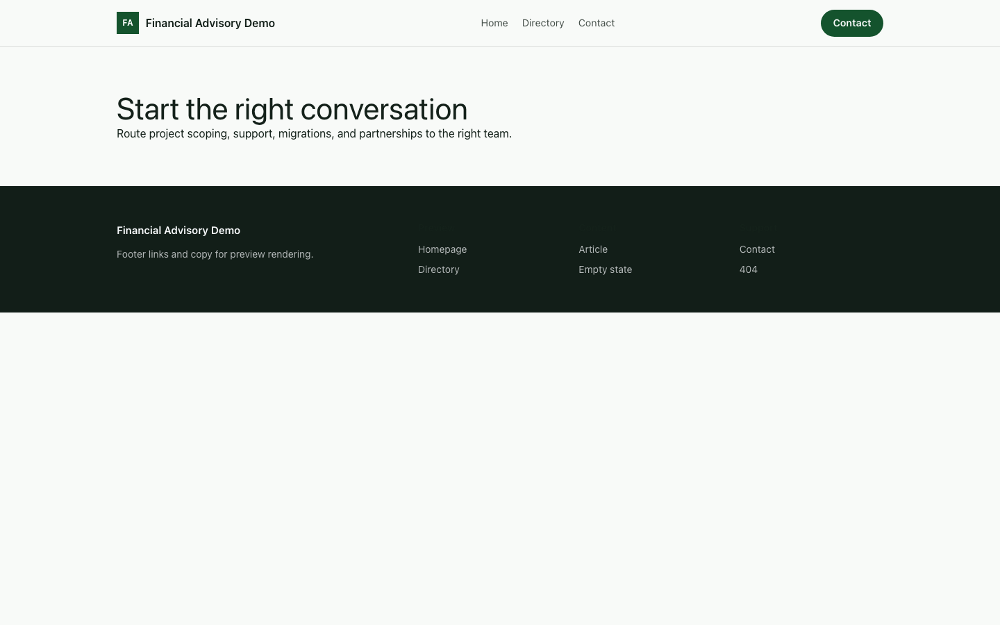

# Theme Financial Advisory

Financial Advisory provides a distinct Capell frontend theme for Sterling & Vale Advisors. From the repository root, run `vendor/bin/pest packages/theme-financial-advisory/tests`; this package does not ship its own PHPUnit config.

## Screenshot Evidence

These captures are the package-owned visual contract for the admin pages, public pages, actions, workflows, and feature surfaces described above. Keep this section aligned with `docs/screenshots.json` whenever the package surface changes.

### Financial Advisory Homepage

- Surface: frontend · Target: /.
- Documents: Theme marketplace preview.
- Capture notes: Financial Advisory Homepage.

### Financial Advisory Landing page

- Surface: frontend · Target: /.
- Documents: Theme marketplace preview.
- Capture notes: Financial Advisory Landing page.

### Financial Advisory List page

- Surface: frontend · Target: /.
- Documents: Theme marketplace preview.
- Capture notes: Financial Advisory List page.

### Financial Advisory Search results

- Surface: frontend · Target: /.
- Documents: Theme marketplace preview.
- Capture notes: Financial Advisory Search results.

### Financial Advisory Contact form

- Surface: frontend · Target: /.
- Documents: Theme marketplace preview.
- Capture notes: Financial Advisory Contact form.
