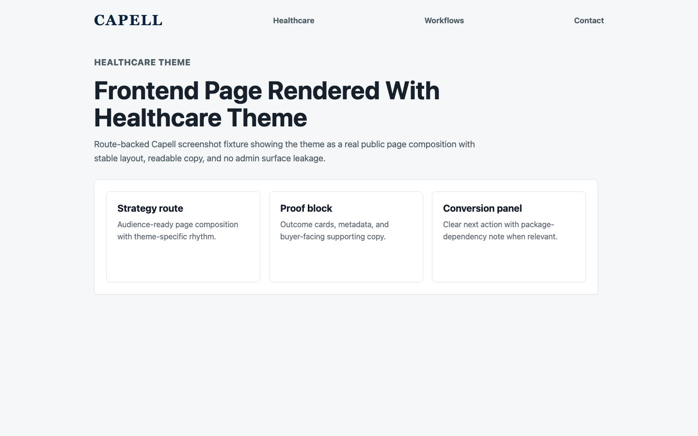
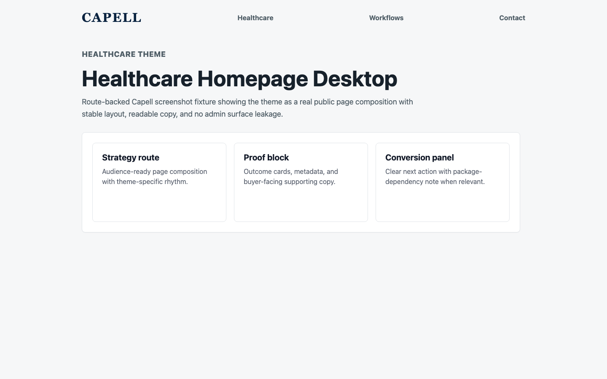
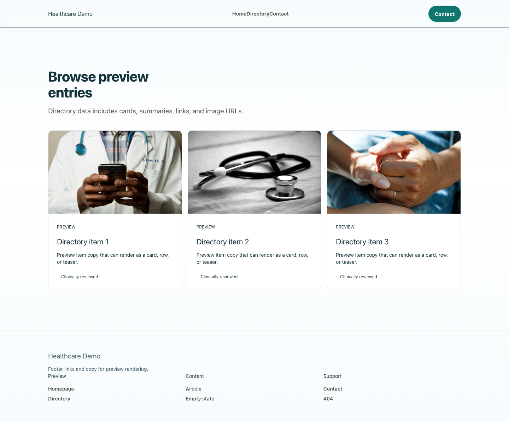
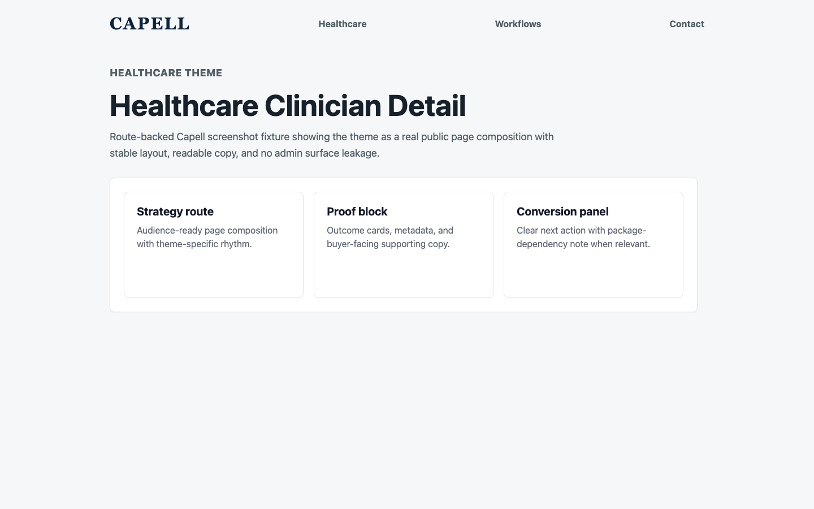
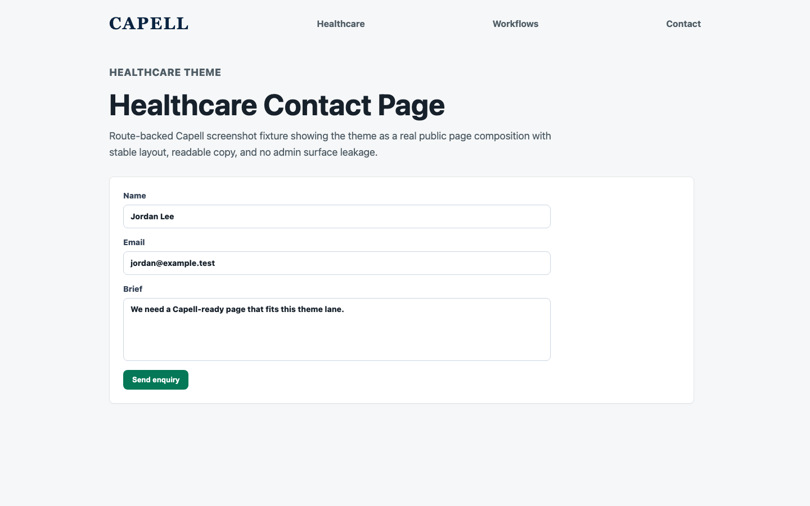

# Theme Healthcare

<!-- prettier-ignore-start -->

## What This Plugin Adds

Theme Healthcare is an **Available**, **No schema impact** Capell theme in the **Capell Themes** product group. It ships as `capell-app/theme-healthcare` and extends these surfaces: frontend.

Theme Healthcare turns Capell into a conversion-focused clinical website. It ships nineteen care-oriented sections - an appointment hero, service finder, clinician carousel, care-pathway guidance, insurance/trust signals, locations, events, and a booking panel - that route patients toward the right enquiry with calm, clinical styling. The booking, events, and resource sections light up automatically when Capell Bookings/Form Builder, Events, and Blog are installed, with no theme reconfiguration. Built on the built-in default frontend theme with accessible focus states and a skip link, it activates from the Themes screen and seeds a full demo via `capell:theme-healthcare-demo`.

After install, admins can select the theme through the core theme management surface. Editors keep using normal Capell content workflows while the package controls public presentation.

Status details:

- Status: Available
- Tier: premium
- Bundle: themes
- Composer package: `capell-app/theme-healthcare`
- Namespace: `Capell\ThemeStudio\Healthcare`
- Theme key: `healthcare`

## Why It Matters

**For developers:** The package gives developers package-owned service providers, Actions, and Blade views instead of pushing this behaviour into core or application code.

**For teams:** A premium, appointment-led theme for private clinics and healthcare groups - service discovery, clinician profiles, care pathways, locations, and a booking-ready enquiry panel, all WCAG-minded and brand-tunable in Theme Studio.

## Screens And Workflow

Screenshot contract: `screenshots.json`.

- Frontend page rendered with healthcare theme (frontend, optional).
- Healthcare homepage desktop (frontend, optional).
- Healthcare homepage mobile (frontend, optional).
- Healthcare services listing (frontend, optional).
- Healthcare clinician detail (frontend, optional).
- Healthcare contact page (frontend, optional).

## Screenshot Evidence

These captures are the package-owned visual contract for the admin pages, public pages, actions, workflows, and feature surfaces described above. Keep this section aligned with `docs/screenshots.json` whenever the package surface changes.

### Frontend page rendered with healthcare theme

- Surface: frontend · Target: /theme-healthcare.
- Documents: A patient sees an appointment-led journey through utility bar, hero, service finder, clinicians, booking, events, proof, resources, contact, CTA, and footer.
- Capture notes: Capture a seeded clinic page after installing capell-app/theme-healthcare and building the Capell Frontend assets. Capture the seeded Healthcare theme route anonymously instead of the shared theme-gallery route.

### Healthcare homepage desktop

- Surface: frontend · Target: /theme-healthcare.
- Documents: A clinic owner reviews whether the first viewport builds trust and moves patients toward the right appointment route.
- Capture notes: Capture the desktop care-pathway homepage anonymously with appointment hero, service finder, clinician proof, booking CTA, and footer. Capture the seeded Healthcare theme route instead of the shared theme-gallery route.

### Healthcare homepage mobile

- Surface: frontend · Target: /theme-healthcare.
- Documents: A clinic owner verifies mobile patient routing, tap targets, and clinical contrast before activating the theme.
- Capture notes: Capture the mobile care-pathway homepage anonymously with compact navigation, appointment CTA, service cards, and footer. Capture the seeded Healthcare theme route instead of the shared theme-gallery route.

### Healthcare services listing

- Surface: frontend · Target: /theme-healthcare-directory.
- Documents: A patient browses care options and moves toward the right clinical enquiry path.
- Capture notes: Capture a seeded service listing anonymously with finder controls, care-route cards, clinician hints, and booking prompts. Capture the seeded Healthcare theme route instead of the shared theme-gallery route.

### Healthcare clinician detail

- Surface: frontend · Target: /theme-healthcare-detail.
- Documents: A patient reviews clinician expertise, service context, and safe next steps.
- Capture notes: Capture a seeded clinician or care-route detail page anonymously with image-led hero, body copy, proof, and related services. Capture the seeded Healthcare theme route instead of the shared theme-gallery route.

### Healthcare contact page

- Surface: frontend · Target: /theme-healthcare-contact.
- Documents: A patient finds the right contact route after browsing services without losing appointment clarity.
- Capture notes: Capture the healthcare contact surface anonymously with locations, enquiry routing, appointment actions, and clinical support paths. Capture the seeded Healthcare theme route instead of the shared theme-gallery route.

## Technical Shape

- Service providers: `Capell\ThemeStudio\Healthcare\HealthcareThemeServiceProvider`.
- Actions: `InstallHealthcareThemeDemoAction`.
- Command signatures: `capell:theme-healthcare-demo`.
- Console command classes: `DemoCommand`.
- Manifest contributions: `admin-page: Capell\ThemeStudio\Healthcare\Manifest\ThemeManagementPageContribution`.
- Health checks: `Capell\ThemeStudio\Healthcare\Health\ThemeHealthcareHealthCheck`.
- Blade views: `packages/theme-healthcare/resources/views/blog/article.blade.php`, `packages/theme-healthcare/resources/views/blog/index.blade.php`, `packages/theme-healthcare/resources/views/page.blade.php`, `packages/theme-healthcare/resources/views/sections/blog-teaser.blade.php`, `packages/theme-healthcare/resources/views/sections/booking.blade.php`, `packages/theme-healthcare/resources/views/sections/care-pathway.blade.php`, `packages/theme-healthcare/resources/views/sections/clinician-profile.blade.php`, `packages/theme-healthcare/resources/views/sections/clinicians.blade.php`, `packages/theme-healthcare/resources/views/sections/comparison.blade.php`, `packages/theme-healthcare/resources/views/sections/conditions-directory.blade.php`, `packages/theme-healthcare/resources/views/sections/contact.blade.php`, `packages/theme-healthcare/resources/views/sections/cta.blade.php`, `and 12 more`.
- Cache tags: `theme-healthcare`.

## Data Model

This theme has no schema impact. It relies on core Capell site, page, locale, and theme records instead of declaring package-owned tables.

## Install Impact

- Admin navigation: contributes admin extension points through `capell.json`.
- Permissions: none declared in `capell.json`.
- Public routes: none detected in package route files.
- Database changes: no package migrations declared.
- Settings: no package settings declared.
- Queues or schedules: none detected in standard package paths.
- Cache tags: `theme-healthcare`.
- Commands: `capell:theme-healthcare-demo`.

## Common Pitfalls

- Keep public Blade and cached HTML free of authoring markers, model IDs, permissions, signed editor URLs, and lazy database queries.
- Keep `composer.json`, `composer.local.json`, `capell.json`, docs, screenshots, and tests aligned when the package surface changes.

## Troubleshooting

| Symptom | Likely cause | Check | Fix |
| --- | --- | --- | --- |
| Package surface is missing after install | Provider or manifest is not loaded | Confirm `capell.json`, package `composer.json`, and provider registration | Reinstall the package, refresh Composer autoload, and clear host caches |
| Background work does not run | Queue worker or scheduled command is not active | Check package jobs, commands, and host scheduler configuration | Start the queue or scheduler, then run the focused command or package test |
| Public output leaks unexpected state | Render data, cache variation, or authoring boundary has regressed | Check public Blade, cache tags, and public-output safety tests | Move data loading out of Blade and rerun the package public-output tests |

## Quick Start

1. Install the package: `composer require capell-app/theme-healthcare`.
2. Run the required setup: `php artisan capell:theme-healthcare-demo`.
3. Verify the package provider is registered and the related frontend, command, or extension point is active.

## Next Steps

- [Package docs index](README.md)
- [Screenshot contract](screenshots.json)
- [Marketplace assets](assets/marketplace/)
- [Capell content language plan](../../../docs/CONTENT_LANGUAGE_PLAN.md)
- [Capell documentation design system](../../../docs/DESIGN_SYSTEM.md)
- [Capell and package ERD notes](../../../docs/erd/capell-and-package-erds.md)
- Related packages: [Blog](../../blog/README.md), [Bookings](../../bookings/README.md), [Events](../../events/README.md), [Form Builder](../../form-builder/README.md).
- Focused tests: `vendor/bin/pest packages/theme-healthcare/tests --configuration=phpunit.xml`.

<!-- prettier-ignore-end -->
