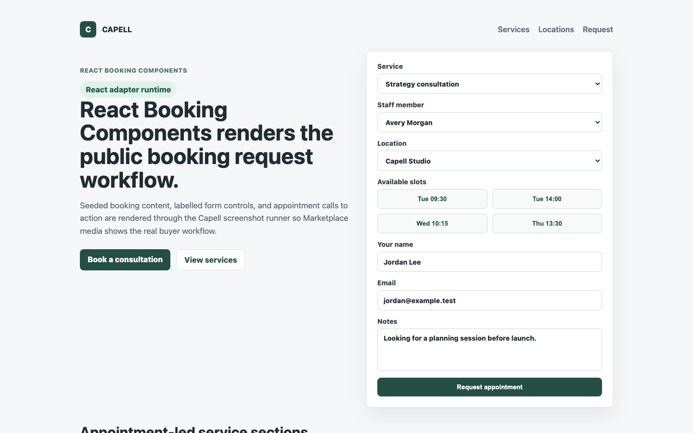
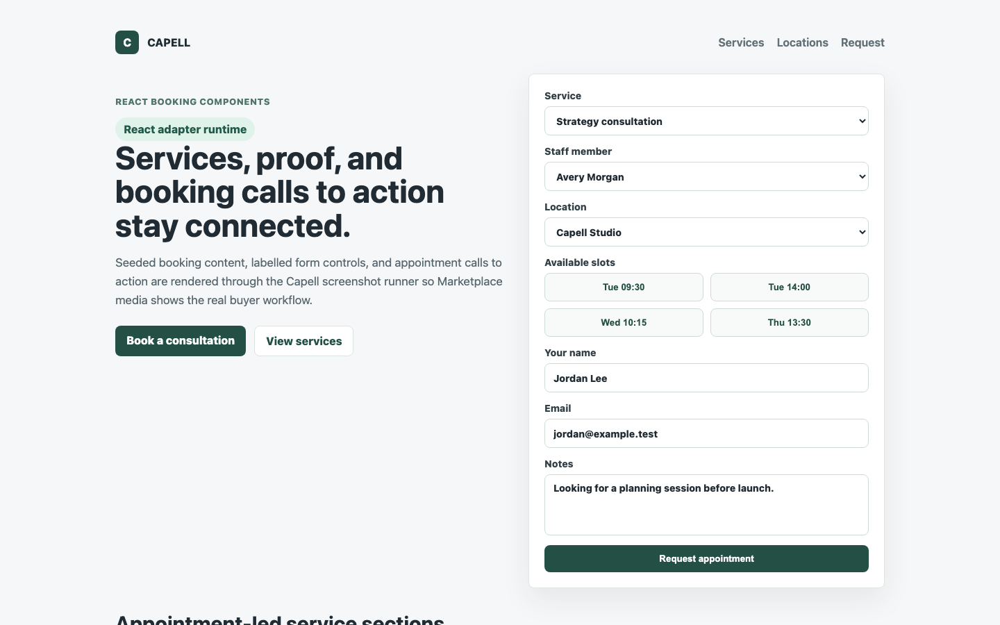
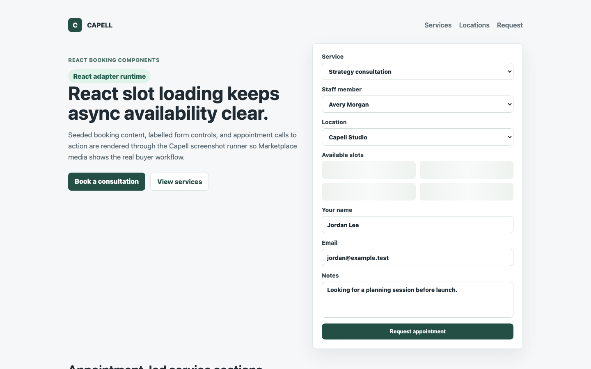
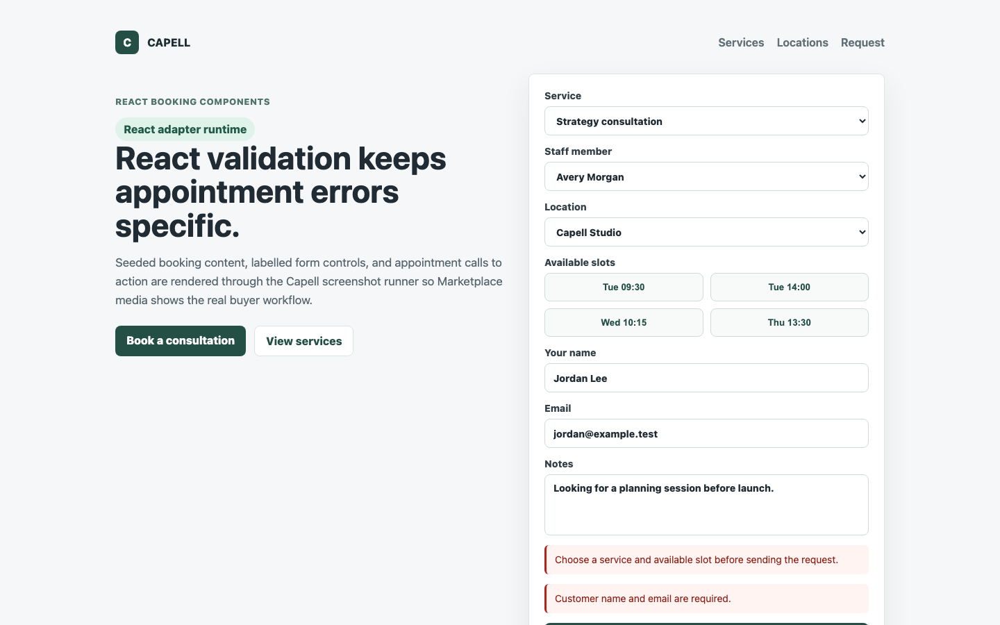
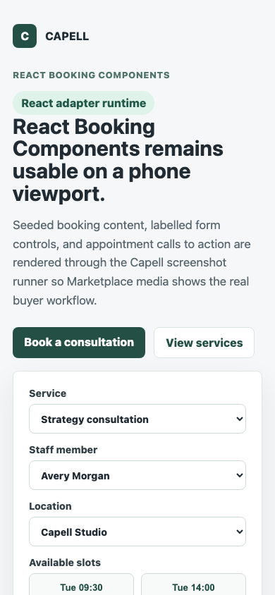

# Theme Inertia Bookings React

<!-- prettier-ignore-start -->

## What This Plugin Adds

Theme Inertia Bookings React is an **Available**, **No schema impact** Capell plugin in the **Capell Themes** product group. It ships as `capell-app/theme-inertia-bookings-react` and extends these surfaces: frontend.

React component pack for the Inertia Bookings theme, including the shared page renderer, the public booking request form, and booking-focused widget components.

After install, the package affects public rendering, public routes, or frontend runtime behaviour.

Status details:

- Status: Available
- Tier: premium
- Bundle: themes
- Composer package: `capell-app/theme-inertia-bookings-react`
- Namespace: `Capell\ThemeStudio\InertiaBookingsReact`
- Theme key: not applicable

## Why It Matters

**For developers:** The package gives React/Inertia applications a package-owned component pack and build entrypoint for the Inertia Bookings theme instead of pushing framework-specific rendering into core or the base theme.

**For teams:** React appointment-request components for service, staff, location, and slot selection, with public validation and loading states that match the screenshot contract.

## Screens And Workflow

Screenshot contract: `screenshots.json`.

- React booking component pack (frontend, required).
- React themed booking services (frontend, required).
- React booking slot loading state (frontend, required).
- React booking validation state (frontend, required).
- React booking mobile layout (frontend, required).

## Screenshot Evidence

These captures are the package-owned visual contract for the admin pages, public pages, actions, workflows, and feature surfaces described above. Keep this section aligned with `docs/screenshots.json` whenever the package surface changes.

### React booking component pack

- Surface: frontend · Target: /bookings.
- Documents: A buyer confirms the React pack renders the page, widgets, and booking request contract.
- Capture notes: Capture the React adapter runtime with Theme Inertia Bookings installed and the labelled booking request form visible.

### React themed booking services

- Surface: frontend · Target: /theme-inertia-bookings-demo#services.
- Documents: A buyer verifies the React adapter covers the marketing sections, not only the booking form.
- Capture notes: Capture React-rendered service cards and appointment CTAs from the themed component pack.

### React booking slot loading state

- Surface: frontend · Target: /bookings.
- Documents: A buyer checks that async slot selection has an understandable React loading state.
- Capture notes: Capture the public request form while available slots are loading or refreshing.

### React booking validation state

- Surface: frontend · Target: /bookings.
- Documents: A buyer confirms the React pack presents booking errors without relying on placeholders.
- Capture notes: Capture validation feedback on required customer fields and service/slot selection.

### React booking mobile layout

- Surface: frontend · Target: /bookings.
- Documents: A buyer verifies the React component pack works for phone-based appointment requests.
- Capture notes: Capture the React booking request page at a mobile viewport with labels and CTA visible.

## Technical Shape

- Service providers: `Capell\ThemeStudio\InertiaBookingsReact\Providers\InertiaBookingsReactServiceProvider`.
- Manifest contributions: `frontend-component: Capell\ThemeStudio\InertiaBookingsReact\Manifest\InertiaBookingsReactComponentContribution`.
- Health checks: `Capell\ThemeStudio\InertiaBookingsReact\Health\InertiaBookingsReactHealthCheck`.
- Cache tags: `theme-inertia-bookings-react`.

## Data Model

This package has no schema impact. It does not declare package-owned migrations or required tables.

Booking persistence, validation, and request props are owned by the Bookings and Theme Inertia Bookings packages. This adapter owns only React component registration, the React build entrypoint, and public-safe rendering of the server-provided Inertia props.

## Adapter Boundary

Install this package when the host Capell/Inertia frontend uses React and the Inertia Bookings theme is installed. The base theme owns the booking renderer binding, `capell-app/inertia-react-adapter` provides the generic React runtime, and this package supplies the first-party booking components that override the generic fallback.

The public booking request form renders inline `.error` messages from Inertia validation errors and a stable `.slots` region while available times are deferred or refreshed. These selectors are intentionally public presentation state for screenshots and accessibility; they must not contain admin/editor metadata, signed URLs, model IDs, field paths, package internals, or authoring controls.

## Install Impact

- Admin navigation: no admin surface declared.
- Permissions: none declared in `capell.json`.
- Public routes: none detected in package route files.
- Database changes: no package migrations declared.
- Settings: no package settings declared.
- Queues or schedules: none detected in standard package paths.
- Cache tags: `theme-inertia-bookings-react`.
- Commands: none declared.

## Common Pitfalls

- Keep public Blade and cached HTML free of authoring markers, model IDs, permissions, signed editor URLs, and lazy database queries.
- Keep `composer.json`, `composer.local.json`, `capell.json`, docs, screenshots, and tests aligned when the package surface changes.

## Troubleshooting

| Symptom | Likely cause | Check | Fix |
| --- | --- | --- | --- |
| Package surface is missing after install | Provider or manifest is not loaded | Confirm `capell.json`, package `composer.json`, and provider registration | Reinstall the package, refresh Composer autoload, and clear host caches |
| Public output leaks unexpected state | Render data, cache variation, or authoring boundary has regressed | Check public Blade, cache tags, and public-output safety tests | Move data loading out of Blade and rerun the package public-output tests |

## Quick Start

1. Install the package: `composer require capell-app/theme-inertia-bookings-react`.
2. Run the required setup: no package migrations are declared; clear cached config and routes if the host app uses caches.
3. Verify the package provider is registered and the related frontend, command, or extension point is active.

## Next Steps

- [Package docs index](README.md)
- [Screenshot contract](screenshots.json)
- [Marketplace assets](assets/marketplace/)
- [Capell content language plan](../../../docs/CONTENT_LANGUAGE_PLAN.md)
- [Capell documentation design system](../../../docs/DESIGN_SYSTEM.md)
- [Capell and package ERD notes](../../../docs/erd/capell-and-package-erds.md)
- Related packages: [Theme Inertia Bookings](../../theme-inertia-bookings/README.md), [Inertia React Adapter](../../inertia-react-adapter/README.md).
- Focused tests: `vendor/bin/pest packages/theme-inertia-bookings-react/tests --configuration=phpunit.xml`.

<!-- prettier-ignore-end -->
