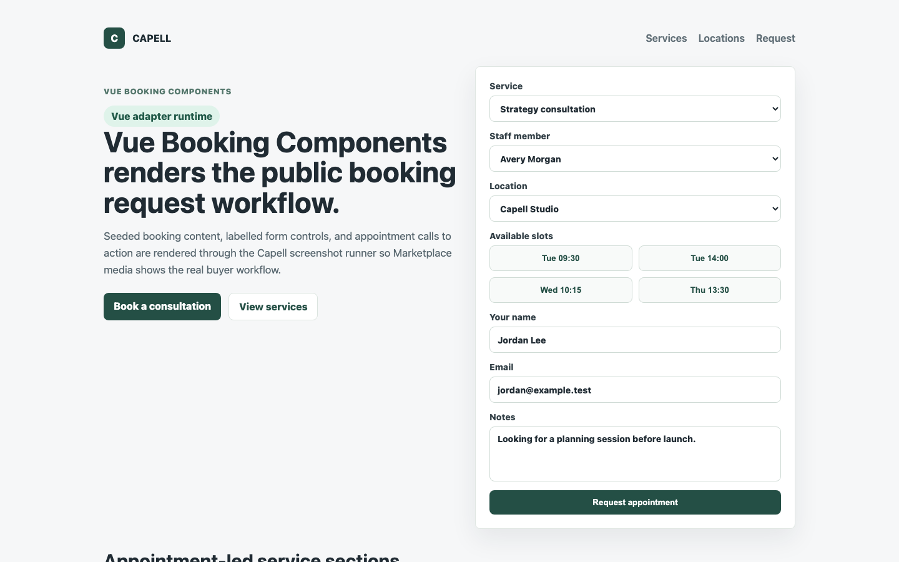
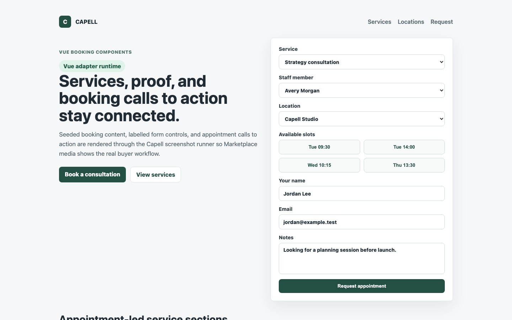
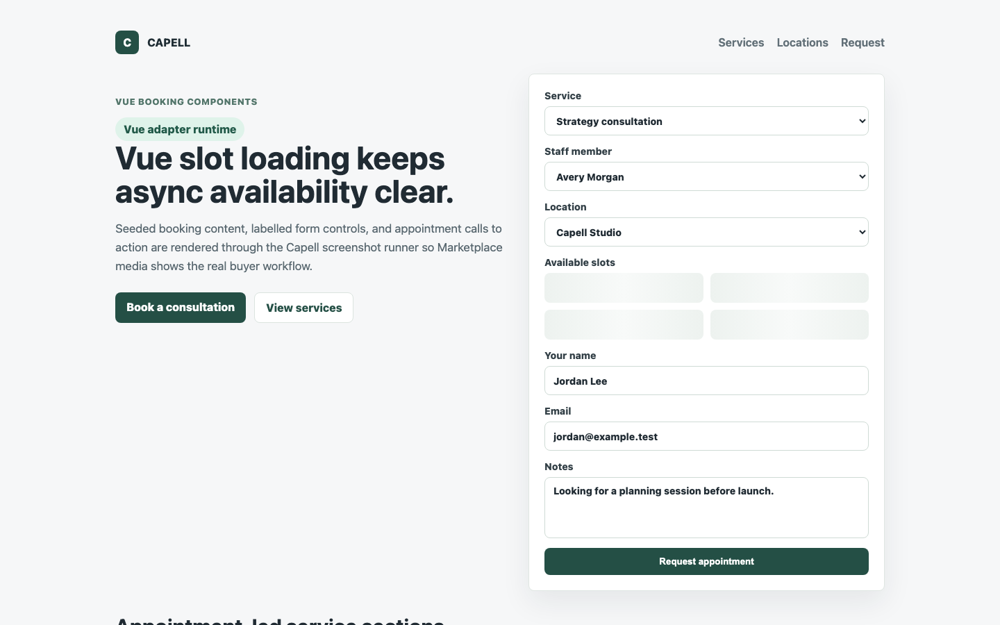
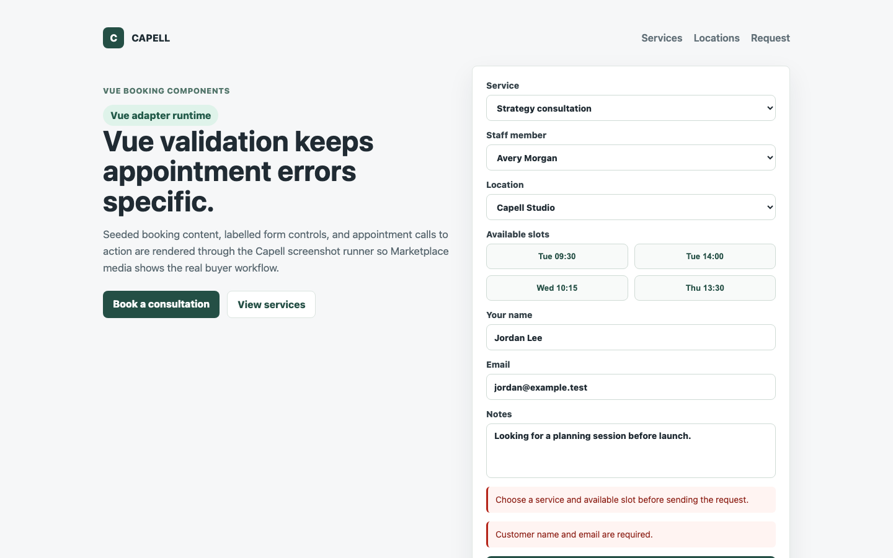
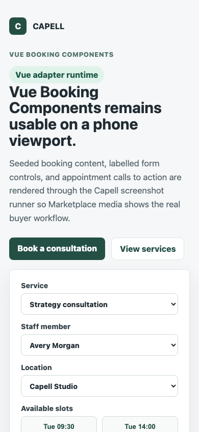

# Theme Inertia Bookings Vue

<!-- prettier-ignore-start -->

## What This Plugin Adds

Theme Inertia Bookings Vue is an **Available**, **No schema impact** Capell plugin in the **Capell Themes** product group. It ships as `capell-app/theme-inertia-bookings-vue` and extends these surfaces: frontend.

Vue component pack for the Inertia Bookings theme, including the booking request form, page renderer, and booking-focused widget components.

After install, the package affects public rendering, public routes, or frontend runtime behaviour.

Status details:

- Status: Available
- Tier: premium
- Bundle: themes
- Composer package: `capell-app/theme-inertia-bookings-vue`
- Namespace: `Capell\ThemeStudio\InertiaBookingsVue`
- Theme key: not applicable

## Why It Matters

**For developers:** The package supplies the Vue build entrypoint and component map for Capell's booking-specific Inertia contracts. The base `theme-inertia-bookings` package owns the renderer binding, and the generic `inertia-vue-adapter` provides the Vue adapter this component pack builds on.

**For teams:** Vue sites can install the booking theme without rebuilding the public booking journey from scratch. The request form renders accessible validation errors, loading states for deferred slots, and the same server-owned booking props used by the base theme.

## Screens And Workflow

Screenshot contract: `screenshots.json`.

- Vue booking component pack (frontend, required).
- Vue themed booking services (frontend, required).
- Vue booking slot loading state (frontend, required).
- Vue booking validation state (frontend, required).
- Vue booking mobile layout (frontend, required).

## Screenshot Evidence

These captures are the package-owned visual contract for the admin pages, public pages, actions, workflows, and feature surfaces described above. Keep this section aligned with `docs/screenshots.json` whenever the package surface changes.

### Vue booking component pack

- Surface: frontend · Target: /bookings.
- Documents: A buyer confirms the Vue pack renders the page, widgets, and booking request contract.
- Capture notes: Capture the Vue adapter runtime with Theme Inertia Bookings installed and the labelled booking request form visible.

### Vue themed booking services

- Surface: frontend · Target: /theme-inertia-bookings-demo#services.
- Documents: A buyer verifies the Vue adapter covers the marketing sections, not only the booking form.
- Capture notes: Capture Vue-rendered service cards and appointment CTAs from the themed component pack.

### Vue booking slot loading state

- Surface: frontend · Target: /bookings.
- Documents: A buyer checks that async slot selection has an understandable Vue loading state.
- Capture notes: Capture the public request form while available slots are loading or refreshing.

### Vue booking validation state

- Surface: frontend · Target: /bookings.
- Documents: A buyer confirms the Vue pack presents booking errors without relying on placeholders.
- Capture notes: Capture validation feedback on required customer fields and service/slot selection.

### Vue booking mobile layout

- Surface: frontend · Target: /bookings.
- Documents: A buyer verifies the Vue component pack works for phone-based appointment requests.
- Capture notes: Capture the Vue booking request page at a mobile viewport with labels and CTA visible.

## Technical Shape

- Service providers: `Capell\ThemeStudio\InertiaBookingsVue\Providers\InertiaBookingsVueServiceProvider`.
- Manifest contributions: `frontend-component: Capell\ThemeStudio\InertiaBookingsVue\Manifest\InertiaBookingsVueComponentContribution`.
- Health checks: `Capell\ThemeStudio\InertiaBookingsVue\Health\InertiaBookingsVueHealthCheck`.
- Cache tags: `theme-inertia-bookings-vue`.
- Vue components: `Capell/Page` fallback, `Capell/Bookings/Request`, and booking widget renderers for Content, Image, and Title.
- Raw HTML contract: `Page.vue` and `Content.vue` use `v-html` only for server-provided portable HTML props (`page.content` and `widget.data.content`). Those props must already be sanitized by the Capell render pipeline and must not contain authoring metadata, admin URLs, signed editor URLs, model IDs, field paths, permissions, or package internals.

## Data Model

This package has no schema impact. It does not declare package-owned migrations or required tables. Booking records, validation, slot availability, and request props are owned by the Bookings package and the base Inertia Bookings theme.

## Install Impact

- Admin navigation: no admin surface declared.
- Permissions: none declared in `capell.json`.
- Public routes: none detected in package route files.
- Database changes: no package migrations declared.
- Settings: no package settings declared.
- Queues or schedules: none detected in standard package paths.
- Cache tags: `theme-inertia-bookings-vue`.
- Commands: none declared.

## Common Pitfalls

- Keep public Blade and cached HTML free of authoring markers, model IDs, permissions, signed editor URLs, and lazy database queries.
- Keep `composer.json`, `composer.local.json`, `capell.json`, docs, screenshots, and tests aligned when the package surface changes.

## Troubleshooting

| Symptom | Likely cause | Check | Fix |
| --- | --- | --- | --- |
| Package surface is missing after install | Provider or manifest is not loaded | Confirm `capell.json`, package `composer.json`, and provider registration | Reinstall the package, refresh Composer autoload, and clear host caches |
| Public output leaks unexpected state | Render data, cache variation, or authoring boundary has regressed | Check public Blade, cache tags, and public-output safety tests | Move data loading out of Blade and rerun the package public-output tests |

## Quick Start

1. Install the package: `composer require capell-app/theme-inertia-bookings-vue`.
2. Run the required setup: no package migrations are declared; clear cached config and routes if the host app uses caches.
3. Verify the package provider is registered and the related frontend, command, or extension point is active.

## Next Steps

- [Package docs index](README.md)
- [Screenshot contract](screenshots.json)
- [Marketplace assets](assets/marketplace/)
- [Capell content language plan](../../../docs/CONTENT_LANGUAGE_PLAN.md)
- [Capell documentation design system](../../../docs/DESIGN_SYSTEM.md)
- [Capell and package ERD notes](../../../docs/erd/capell-and-package-erds.md)
- Related packages: [Theme Inertia Bookings](../../theme-inertia-bookings/README.md), [Inertia Vue Adapter](../../inertia-vue-adapter/README.md).
- Focused tests: `vendor/bin/pest packages/theme-inertia-bookings-vue/tests --configuration=phpunit.xml`.

<!-- prettier-ignore-end -->
