
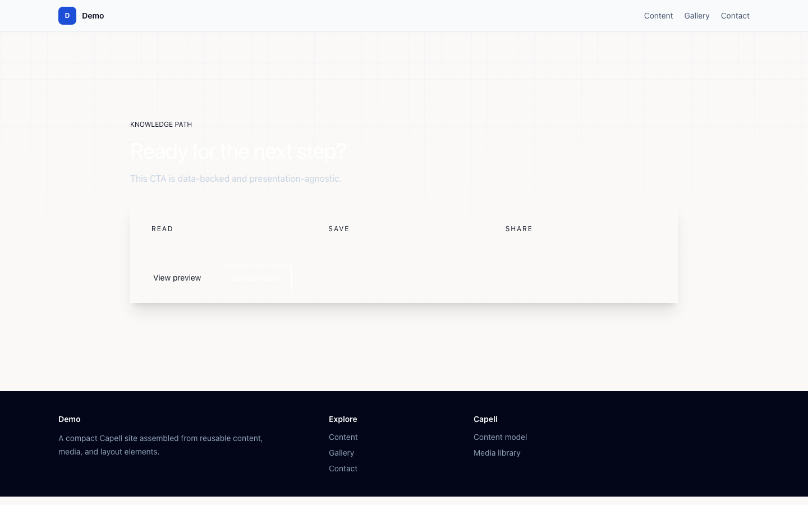
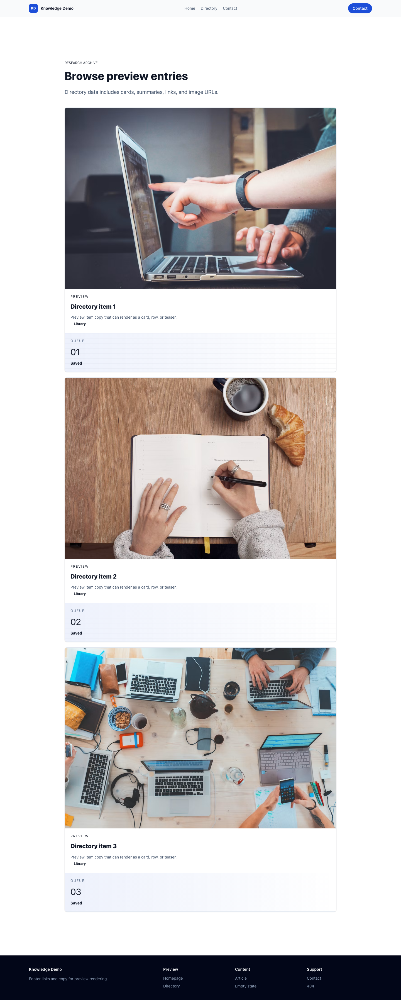

# Theme Knowledge

<!-- prettier-ignore-start -->

## What This Plugin Adds

Theme Knowledge is an **Available**, **No schema impact** Capell theme in the **Capell Themes** product group. It ships as `capell-app/theme-knowledge` and extends these surfaces: frontend.

Editorial and resource-library theme for knowledge bases, publishers, and content-led teams.

After install, admins can select the theme through the core theme management surface. Editors keep using normal Capell content workflows while the package controls public presentation.

Status details:

- Status: Available
- Tier: premium
- Bundle: themes
- Composer package: `capell-app/theme-knowledge`
- Namespace: `Capell\ThemeStudio\Knowledge`
- Theme key: `knowledge`

## Why It Matters

**For developers:** The package gives developers package-owned service providers, Actions, and Blade views instead of pushing this behaviour into core or application code.

**For teams:** A premium knowledge-base and documentation theme for Capell - sidebar-navigated articles, in-page table of contents, prominent search, and readable long-form layouts out of the box.

## Screens And Workflow

Screenshot contract: `screenshots.json`.

- Frontend page rendered with Knowledge theme (frontend, optional).
- Knowledge homepage (frontend, optional).
- Search results and facets (frontend, optional).
- Topic hubs (frontend, optional).
- Featured research (frontend, optional).
- Research digest signup (frontend, optional).
- Author bench (frontend, optional).

## Screenshot Evidence

These captures are the package-owned visual contract for the admin pages, public pages, actions, workflows, and feature surfaces described above. Keep this section aligned with `docs/screenshots.json` whenever the package surface changes.

### Frontend page rendered with Knowledge theme

- Surface: frontend · Target: /theme-knowledge.
- Documents: A publisher sees how the theme turns a content archive into a searchable reader journey.
- Capture notes: Capture the seeded package theme route instead of the shared theme-gallery route. Optional until the Capell runner can browser-capture seeded package theme routes without navigation failures.

### Knowledge homepage

- Surface: frontend · Target: /theme-knowledge.
- Documents: A resource-site buyer checks whether the first viewport feels like a serious library rather than a blog skin.
- Capture notes: Capture the seeded package theme route instead of the shared theme-gallery route. Optional until the Capell runner can browser-capture seeded package theme routes without navigation failures.

### Search results and facets

- Surface: frontend · Target: /theme-knowledge-directory.
- Documents: A reader can find guides, research notes, and templates without the page collapsing into a plain listing.
- Capture notes: Capture the seeded package theme route instead of the shared theme-gallery route. Optional until the Capell runner can browser-capture seeded package theme routes without navigation failures.

### Topic hubs

- Surface: frontend · Target: /theme-knowledge-directory.
- Documents: An editorial team reviews how the theme makes deep archives browseable by subject.
- Capture notes: Capture the seeded package theme route instead of the shared theme-gallery route. Optional until the Capell runner can browser-capture seeded package theme routes without navigation failures.

### Featured research

- Surface: frontend · Target: /theme-knowledge-directory.
- Documents: A publisher checks that high-value research can be promoted without looking like a standard news card.
- Capture notes: Capture the seeded package theme route instead of the shared theme-gallery route. Optional until the Capell runner can browser-capture seeded package theme routes without navigation failures.

### Research digest signup

- Surface: frontend · Target: /theme-knowledge-cta.
- Documents: A publisher checks how the theme turns reading intent into an owned-audience signup.
- Capture notes: Capture the seeded package theme route instead of the shared theme-gallery route. Optional until the Capell runner can browser-capture seeded package theme routes without navigation failures.

### Author bench

- Surface: frontend · Target: /theme-knowledge-directory.
- Documents: A research site can prove expertise without moving into portfolio or agency territory.
- Capture notes: Capture the seeded package theme route instead of the shared theme-gallery route. Optional until the Capell runner can browser-capture seeded package theme routes without navigation failures.

## Technical Shape

- Service providers: `Capell\ThemeStudio\Knowledge\KnowledgeThemeServiceProvider`.
- Actions: `InstallKnowledgeThemeDemoAction`.
- Command signatures: `capell:theme-knowledge-demo`.
- Console command classes: `DemoCommand`.
- Manifest contributions: `admin-page: Capell\ThemeStudio\Knowledge\Manifest\ThemeManagementPageContribution`.
- Health checks: `Capell\ThemeStudio\Knowledge\Health\ThemeKnowledgeHealthCheck`.
- Blade views: `packages/theme-knowledge/resources/views/knowledge-base/article.blade.php`, `packages/theme-knowledge/resources/views/knowledge-base/index.blade.php`, `packages/theme-knowledge/resources/views/knowledge-base/partials/collection-card.blade.php`, `packages/theme-knowledge/resources/views/page.blade.php`, `packages/theme-knowledge/resources/views/sections/authors.blade.php`, `packages/theme-knowledge/resources/views/sections/content-listing.blade.php`, `packages/theme-knowledge/resources/views/sections/cta.blade.php`, `packages/theme-knowledge/resources/views/sections/doc-article.blade.php`, `packages/theme-knowledge/resources/views/sections/featured-content.blade.php`, `packages/theme-knowledge/resources/views/sections/features.blade.php`, `packages/theme-knowledge/resources/views/sections/footer.blade.php`, `packages/theme-knowledge/resources/views/sections/hero.blade.php`, `and 9 more`.
- Cache tags: `theme-knowledge`.

## Data Model

This theme has no schema impact. It relies on core Capell site, page, locale, and theme records instead of declaring package-owned tables.

## Install Impact

- Admin navigation: contributes admin extension points through `capell.json`.
- Permissions: none declared in `capell.json`.
- Public routes: none detected in package route files.
- Database changes: no package migrations declared.
- Settings: no package settings declared.
- Queues or schedules: none detected in standard package paths.
- Cache tags: `theme-knowledge`.
- Commands: `capell:theme-knowledge-demo`.

## Common Pitfalls

- Keep public Blade and cached HTML free of authoring markers, model IDs, permissions, signed editor URLs, and lazy database queries.
- Keep `composer.json`, `composer.local.json`, `capell.json`, docs, screenshots, and tests aligned when the package surface changes.

## Troubleshooting

| Symptom | Likely cause | Check | Fix |
| --- | --- | --- | --- |
| Package surface is missing after install | Provider or manifest is not loaded | Confirm `capell.json`, package `composer.json`, and provider registration | Reinstall the package, refresh Composer autoload, and clear host caches |
| Background work does not run | Queue worker or scheduled command is not active | Check package jobs, commands, and host scheduler configuration | Start the queue or scheduler, then run the focused command or package test |
| Public output leaks unexpected state | Render data, cache variation, or authoring boundary has regressed | Check public Blade, cache tags, and public-output safety tests | Move data loading out of Blade and rerun the package public-output tests |

## Quick Start

1. Install the package: `composer require capell-app/theme-knowledge`.
2. Run the required setup: `php artisan capell:theme-knowledge-demo`.
3. Verify the package provider is registered and the related frontend, command, or extension point is active.

## Next Steps

- [Package docs index](README.md)
- [Screenshot contract](screenshots.json)
- [Marketplace assets](assets/marketplace/)
- [Capell content language plan](../../../docs/CONTENT_LANGUAGE_PLAN.md)
- [Capell documentation design system](../../../docs/DESIGN_SYSTEM.md)
- [Capell and package ERD notes](../../../docs/erd/capell-and-package-erds.md)
- Related packages: [Layout Builder](../../layout-builder/README.md), [Frontend Authoring](../../frontend-authoring/README.md), [Publishing Studio](../../publishing-studio/README.md), [Seo Suite](../../seo-suite/README.md), [Blog](../../blog/README.md), [Search](../../search/README.md), [Newsletter](../../newsletter/README.md).
- Focused tests: `vendor/bin/pest packages/theme-knowledge/tests --configuration=phpunit.xml`.

<!-- prettier-ignore-end -->
