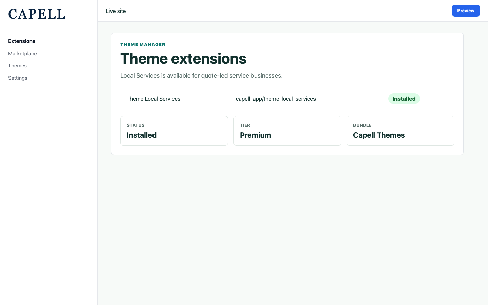
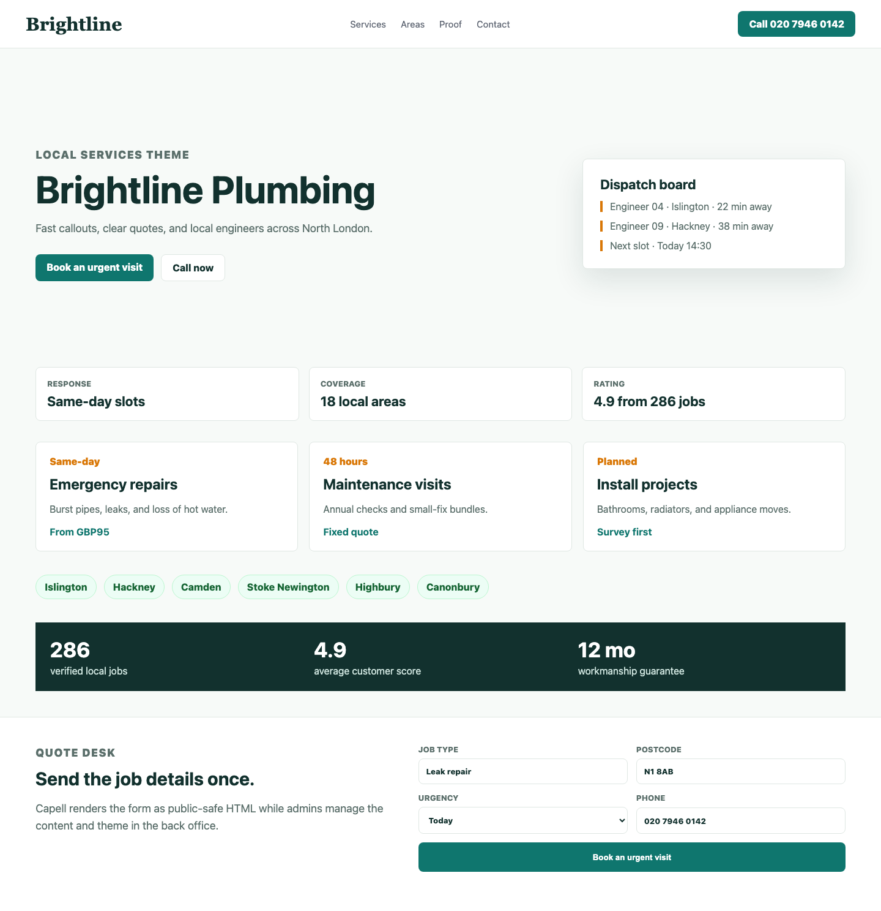
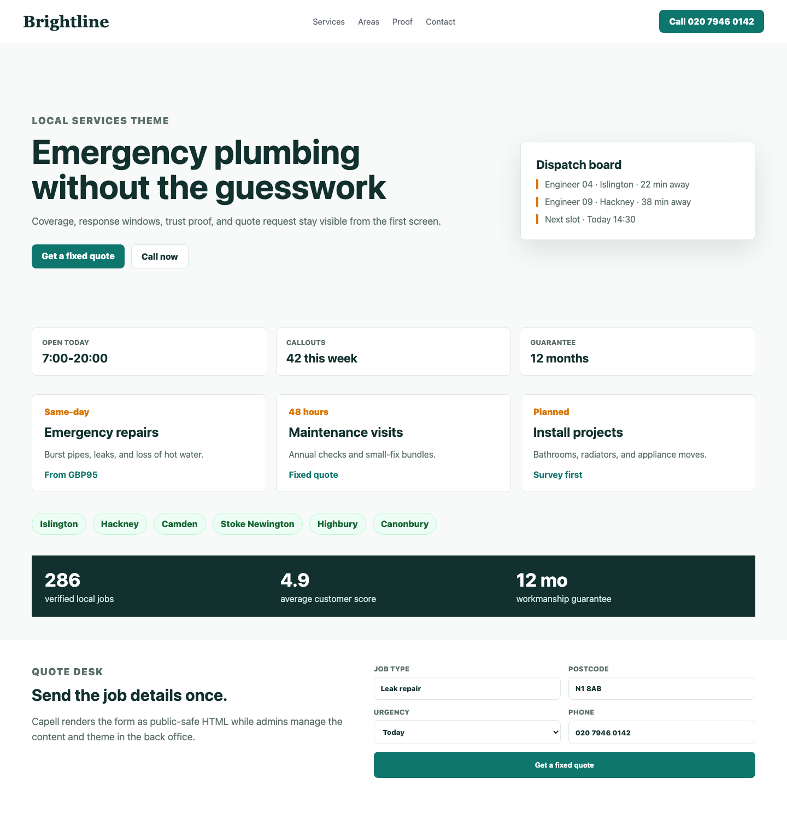
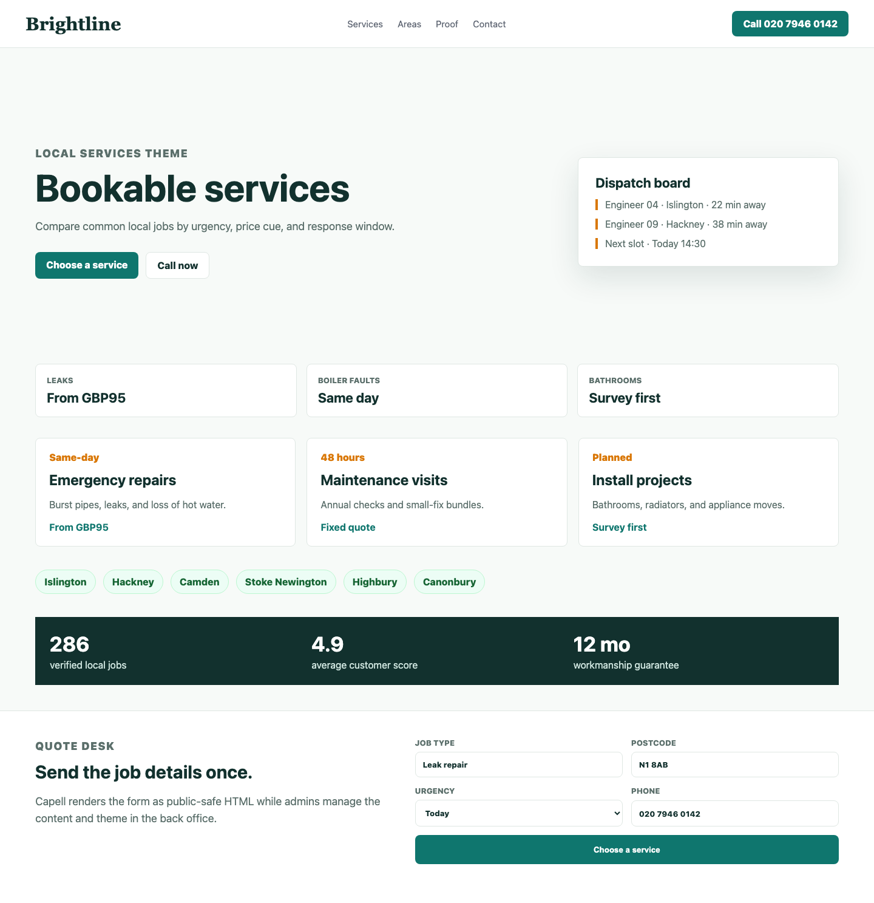
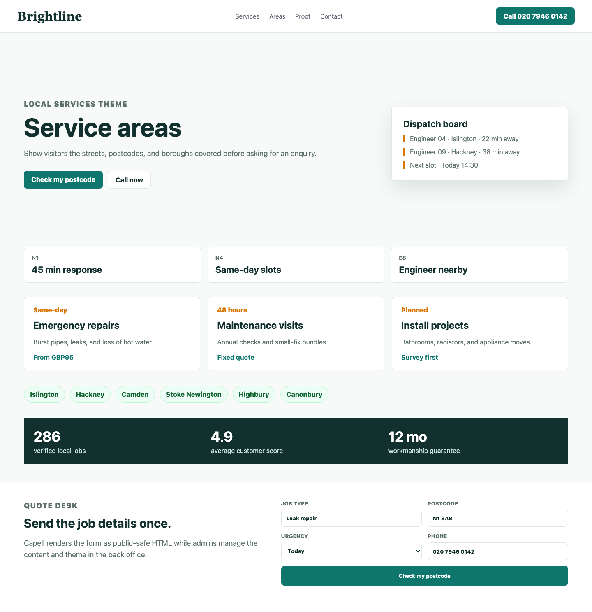
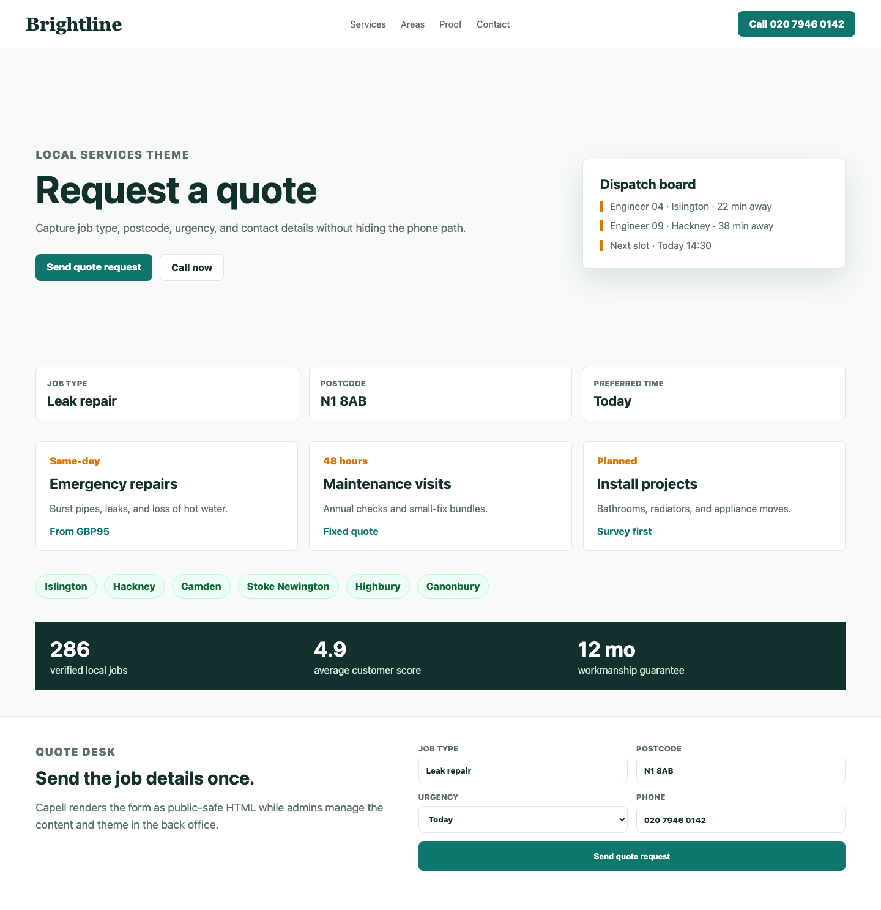
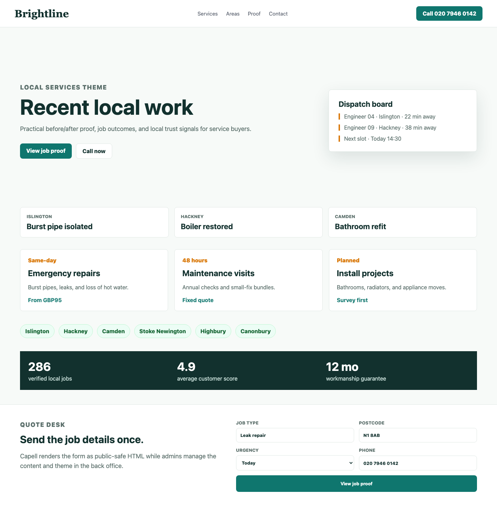
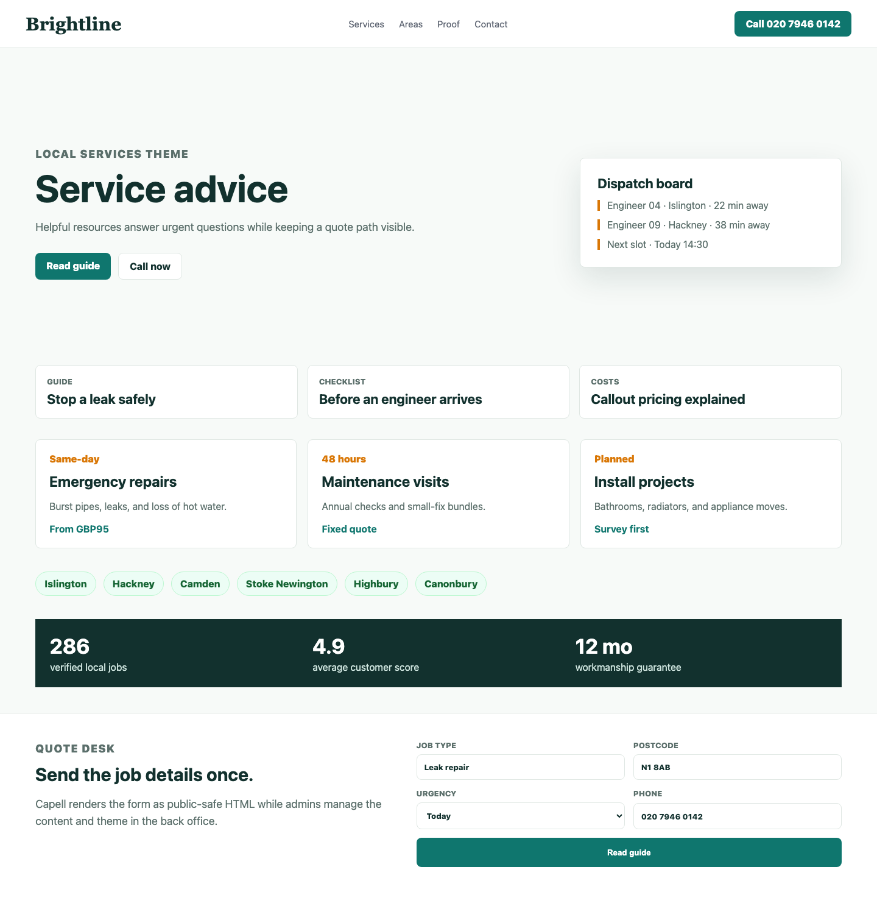
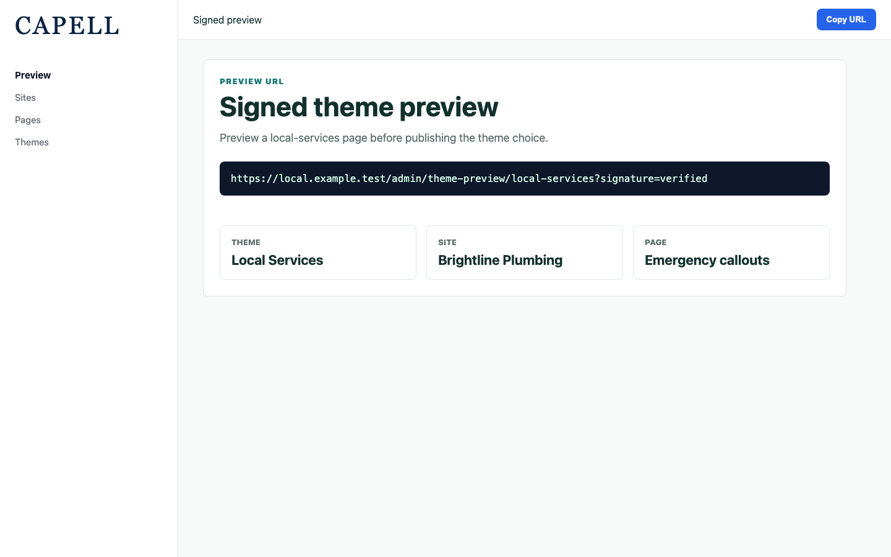

# Theme Local Services

<!-- prettier-ignore-start -->

## What This Plugin Adds

Theme Local Services is an **Available**, **No schema impact** Capell theme in the **Capell Themes** product group. It ships as `capell-app/theme-local-services` and extends these surfaces: frontend, console.

Quote-led service business theme for local operators, trades, clinics, and consultancies.

After install, admins can select the theme through the core theme management surface. Editors keep using normal Capell content workflows while the package controls public presentation.

Status details:

- Status: Available
- Tier: premium
- Bundle: themes
- Composer package: `capell-app/theme-local-services`
- Namespace: `Capell\ThemeStudio\LocalServices`
- Theme key: `local-services`

## Why It Matters

**For developers:** The package gives developers package-owned service providers, Actions, and Blade views instead of pushing this behaviour into core or application code.

**For teams:** A conversion-first Capell theme for local trades, clinics, and service businesses - built around quote requests, service-area coverage, and click-to-call trust.

## Screens And Workflow

Screenshot contract: `screenshots.json`.

- Theme admin list showing Local Services (admin, required).
- Frontend page rendered with Local Services theme (frontend, required).
- Local services homepage (frontend, required).
- Bookable services (frontend, required).
- Service areas (frontend, required).
- Quote request (frontend, required).
- Job proof and case studies (frontend, required).
- Service resources (frontend, required).
- Signed admin preview route (admin, required).

## Screenshot Evidence

These captures are the package-owned visual contract for the admin pages, public pages, actions, workflows, and feature surfaces described above. Keep this section aligned with `docs/screenshots.json` whenever the package surface changes.

### Theme admin list showing Local Services

- Surface: admin · Target: ThemeResource:index.
- Documents: An administrator confirms the Local Services theme is available for quote-led local operators.
- Capture notes: Capture with Capell Frontend default theme, Layout Builder, and capell-app/theme-local-services installed in the isolated demo harness.

### Frontend page rendered with Local Services theme

- Surface: frontend · Target: /theme-local-services-demo.
- Documents: A local operator sees how the theme drives visitors from service need to quote request.
- Capture notes: Capture a seeded service business page with locality hero, services, service areas, quote form, case studies, resources, contact, proof, CTA, and footer.

### Local services homepage

- Surface: frontend · Target: /local-services-homepage-layout.
- Documents: A trades, maintenance, or local service team reviews whether the homepage makes coverage and response clear.
- Capture notes: Capture locality proof, availability signals, dispatch rhythm, and conversion-oriented hero content.

### Bookable services

- Surface: frontend · Target: /local-services-services-layout.
- Documents: A visitor can compare service calls without the page feeling like an agency services grid.
- Capture notes: Capture service cards with urgency markers, pricing cues, eligibility notes, and quote actions.

### Service areas

- Surface: frontend · Target: /local-services-service-areas-layout.
- Documents: A local business proves it serves the visitor's area before asking for an enquiry.
- Capture notes: Capture postcode/area cards, route proof, and coverage-focused CTA copy.

### Quote request

- Surface: frontend · Target: /local-services-quote-form-layout.
- Documents: A local operator checks that quote conversion remains obvious after service discovery.
- Capture notes: Capture the quote form section with static fallback and optional capell-app/form-builder state.

### Job proof and case studies

- Surface: frontend · Target: /local-services-job-proof-layout.
- Documents: A service business can show practical proof without overlapping Portfolio's studio case-study workflow.
- Capture notes: Capture completed-job proof, before/after-style cards, local trust markers, and case study summaries.

### Service resources

- Surface: frontend · Target: /local-services-resources-layout.
- Documents: A local business can answer common service questions while keeping the quote path visible.
- Capture notes: Capture advice/resource cards using static content or the optional blog integration when available.

### Signed admin preview route

- Surface: admin · Target: capell.admin.theme-preview.
- Documents: An administrator previews a local-service page with the theme applied before publishing the theme choice.
- Capture notes: Capture a signed preview URL generated for the seeded Local Services theme, site, and page.

## Technical Shape

- Service providers: `Capell\ThemeStudio\LocalServices\LocalServicesThemeServiceProvider`.
- Actions: `InstallLocalServicesThemeDemoAction`.
- Command signatures: `capell:theme-local-services-demo`.
- Console command classes: `DemoCommand`.
- Manifest contributions: `admin-page: Capell\ThemeStudio\LocalServices\Manifest\ThemeManagementPageContribution`.
- Health checks: `Capell\ThemeStudio\LocalServices\Health\ThemeLocalServicesHealthCheck`.
- Blade views: `packages/theme-local-services/resources/views/page.blade.php`, `packages/theme-local-services/resources/views/sections/before-after-gallery.blade.php`, `packages/theme-local-services/resources/views/sections/case-studies.blade.php`, `packages/theme-local-services/resources/views/sections/contact.blade.php`, `packages/theme-local-services/resources/views/sections/content-listing.blade.php`, `packages/theme-local-services/resources/views/sections/cta.blade.php`, `packages/theme-local-services/resources/views/sections/features.blade.php`, `packages/theme-local-services/resources/views/sections/footer.blade.php`, `packages/theme-local-services/resources/views/sections/hero.blade.php`, `packages/theme-local-services/resources/views/sections/locality-proof.blade.php`, `packages/theme-local-services/resources/views/sections/navigation.blade.php`, `packages/theme-local-services/resources/views/sections/opening-hours.blade.php`, `and 10 more`.
- Cache tags: `theme-local-services`.

## Data Model

This theme has no schema impact. It relies on core Capell site, page, locale, and theme records instead of declaring package-owned tables.

## Install Impact

- Admin navigation: contributes admin extension points through `capell.json`.
- Permissions: none declared in `capell.json`.
- Public routes: none detected in package route files.
- Database changes: no package migrations declared.
- Settings: no package settings declared.
- Queues or schedules: none detected in standard package paths.
- Cache tags: `theme-local-services`.
- Commands: `capell:theme-local-services-demo`.

## Common Pitfalls

- Keep public Blade and cached HTML free of authoring markers, model IDs, permissions, signed editor URLs, and lazy database queries.
- Run package commands from the host app; in this repository use `vendor/bin/pest` for package tests.
- Keep `composer.json`, `composer.local.json`, `capell.json`, docs, screenshots, and tests aligned when the package surface changes.

## Troubleshooting

| Symptom | Likely cause | Check | Fix |
| --- | --- | --- | --- |
| Package surface is missing after install | Provider or manifest is not loaded | Confirm `capell.json`, package `composer.json`, and provider registration | Reinstall the package, refresh Composer autoload, and clear host caches |
| Background work does not run | Queue worker or scheduled command is not active | Check package jobs, commands, and host scheduler configuration | Start the queue or scheduler, then run the focused command or package test |
| Public output leaks unexpected state | Render data, cache variation, or authoring boundary has regressed | Check public Blade, cache tags, and public-output safety tests | Move data loading out of Blade and rerun the package public-output tests |

## Quick Start

1. Install the package: `composer require capell-app/theme-local-services`.
2. Run the required setup: `php artisan capell:theme-local-services-demo`.
3. Verify the package provider is registered and the related frontend, command, or extension point is active.

## Next Steps

- [Package docs index](README.md)
- [Screenshot contract](screenshots.json)
- [Marketplace assets](assets/marketplace/)
- [Capell content language plan](../../../docs/CONTENT_LANGUAGE_PLAN.md)
- [Capell documentation design system](../../../docs/DESIGN_SYSTEM.md)
- [Capell and package ERD notes](../../../docs/erd/capell-and-package-erds.md)
- Related packages: [Address](../../address/README.md), [Blog](../../blog/README.md), [Bookings](../../bookings/README.md), [Events](../../events/README.md), [Frontend Authoring](../../frontend-authoring/README.md), [Form Builder](../../form-builder/README.md), [Layout Builder](../../layout-builder/README.md), [Publishing Studio](../../publishing-studio/README.md), [Seo Suite](../../seo-suite/README.md).
- Focused tests: `vendor/bin/pest packages/theme-local-services/tests --configuration=phpunit.xml`.

<!-- prettier-ignore-end -->
