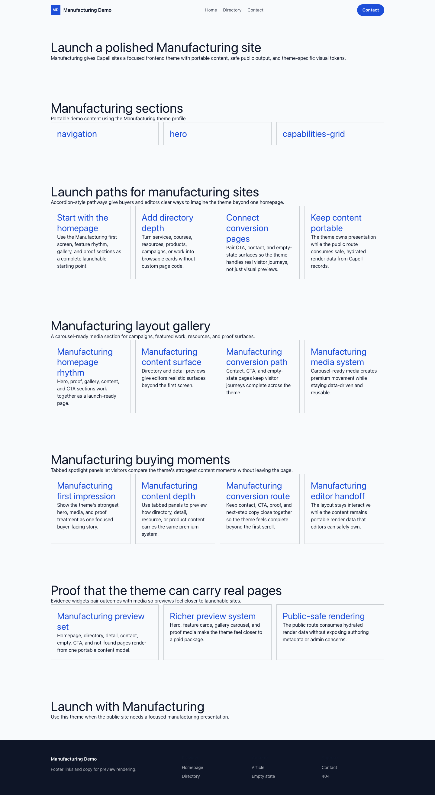
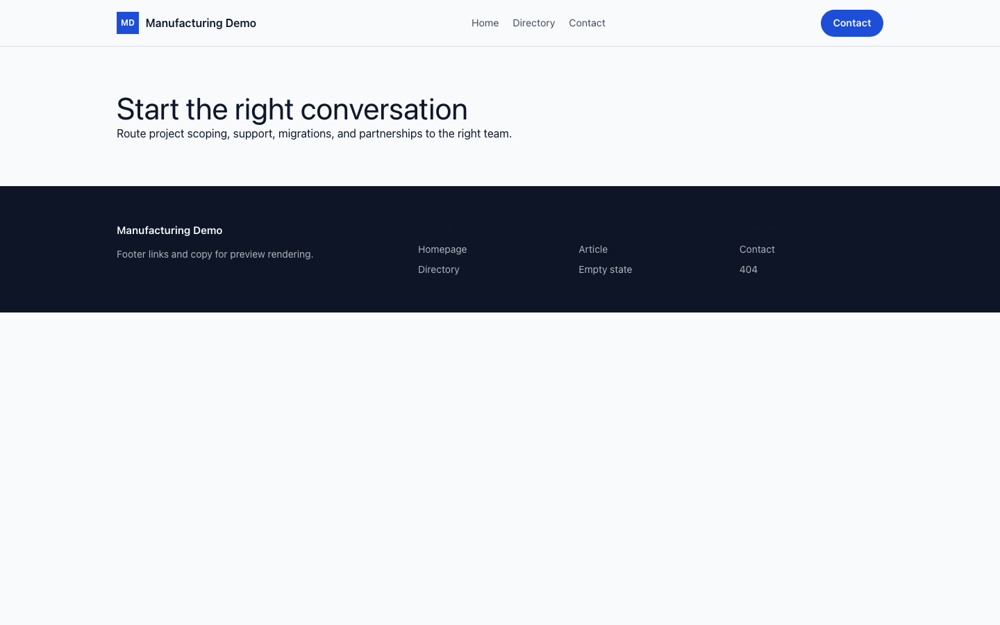

# Theme Manufacturing

Manufacturing provides a distinct Capell frontend theme for Forge Industries. From the repository root, run `vendor/bin/pest packages/theme-manufacturing/tests`; this package does not ship its own PHPUnit config.

## Screenshot Evidence

These captures are the package-owned visual contract for the admin pages, public pages, actions, workflows, and feature surfaces described above. Keep this section aligned with `docs/screenshots.json` whenever the package surface changes.

### Manufacturing Homepage

- Surface: frontend · Target: /.
- Documents: Theme marketplace preview.
- Capture notes: Manufacturing Homepage.

### Manufacturing Landing page

- Surface: frontend · Target: /.
- Documents: Theme marketplace preview.
- Capture notes: Manufacturing Landing page.

### Manufacturing List page

- Surface: frontend · Target: /.
- Documents: Theme marketplace preview.
- Capture notes: Manufacturing List page.

### Manufacturing Search results

- Surface: frontend · Target: /.
- Documents: Theme marketplace preview.
- Capture notes: Manufacturing Search results.

### Manufacturing Contact form

- Surface: frontend · Target: /.
- Documents: Theme marketplace preview.
- Capture notes: Manufacturing Contact form.
