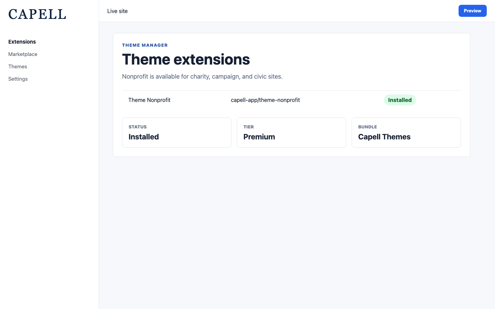
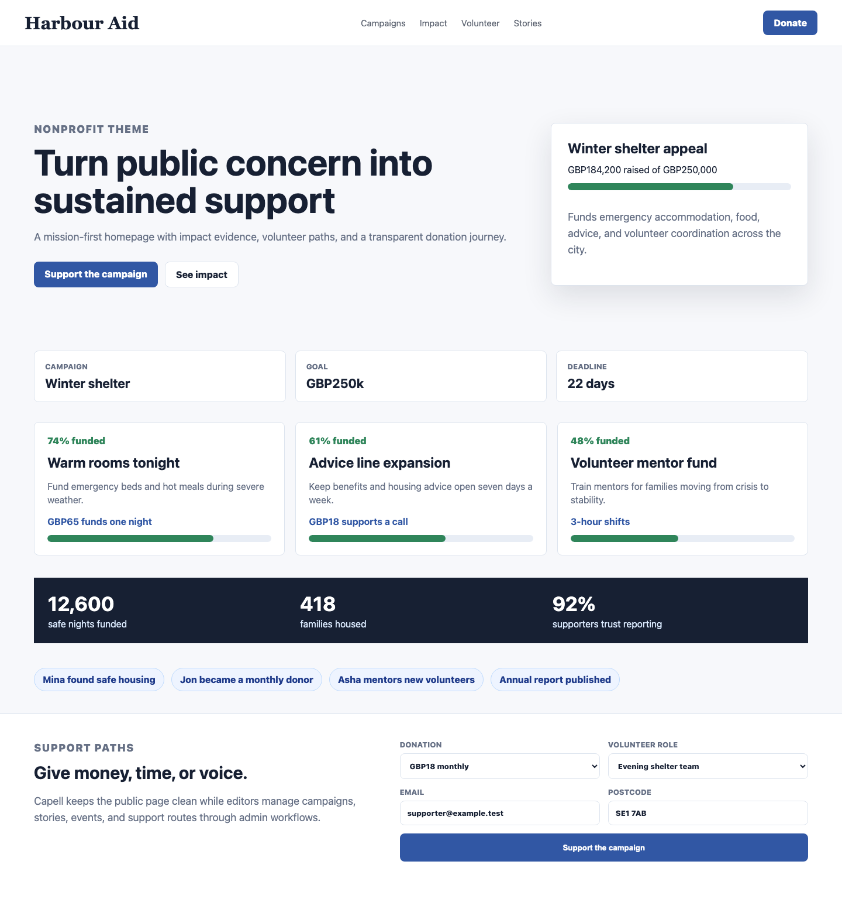
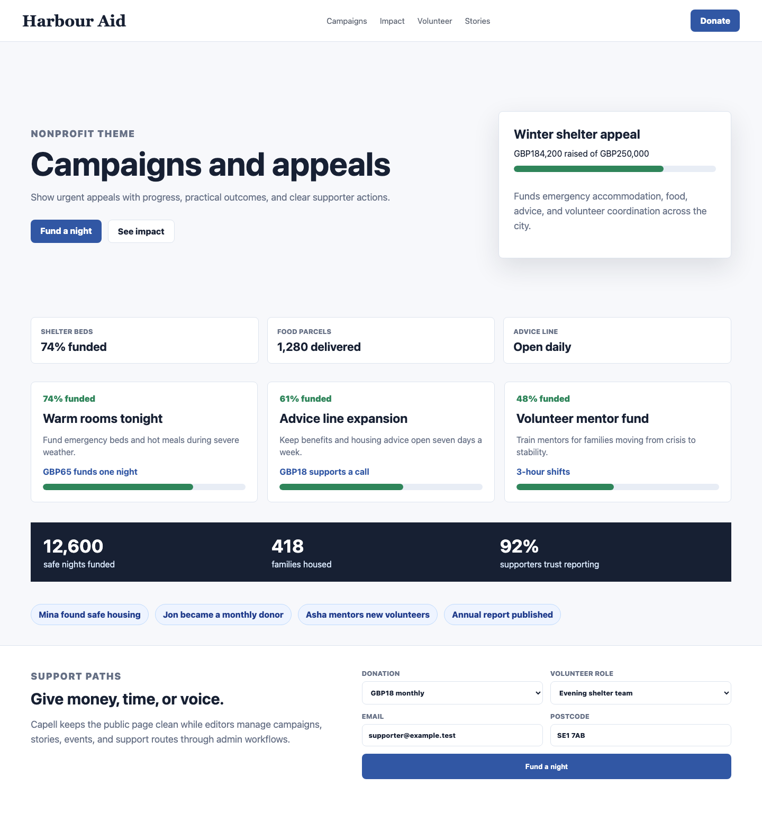
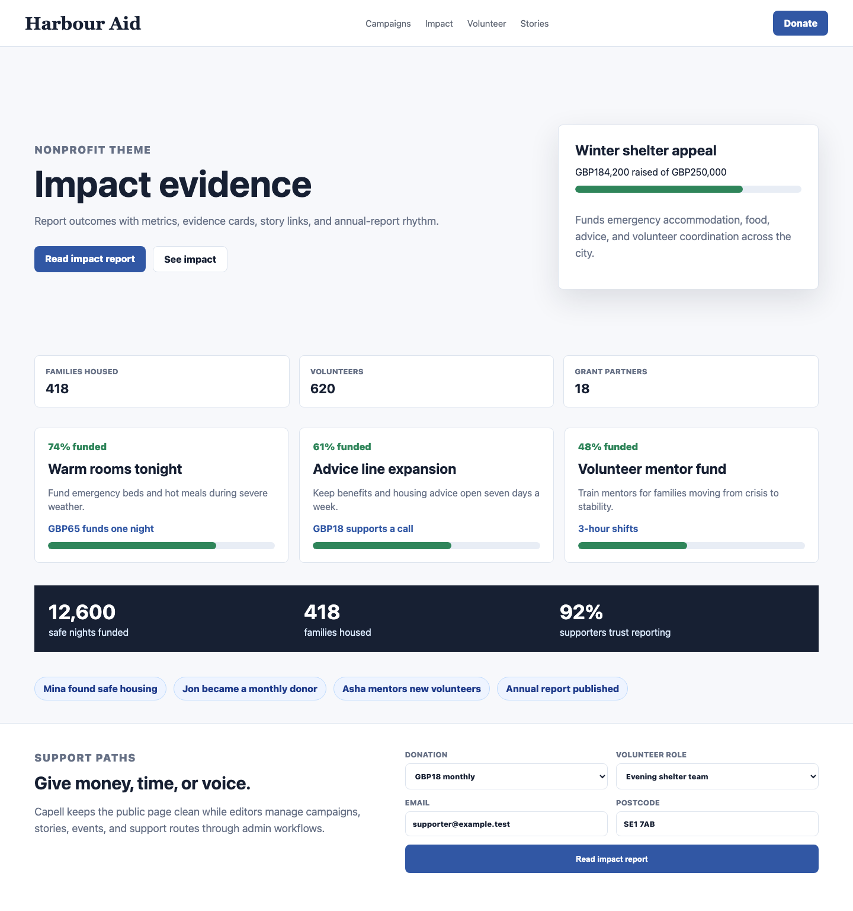
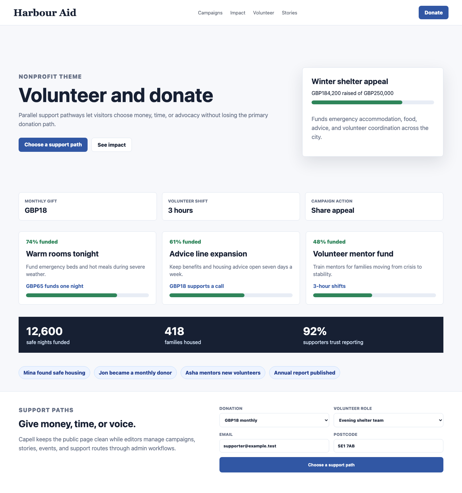
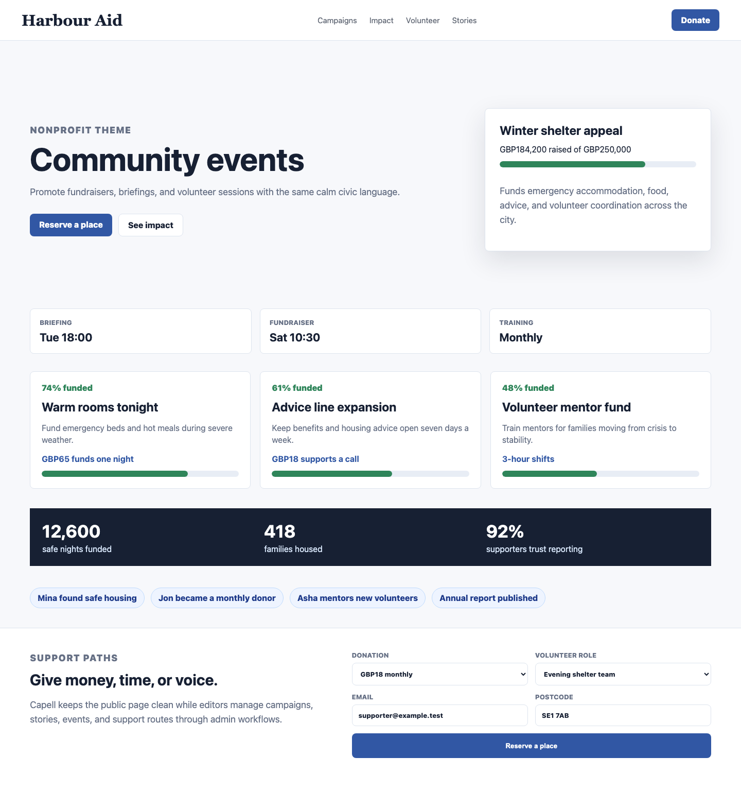
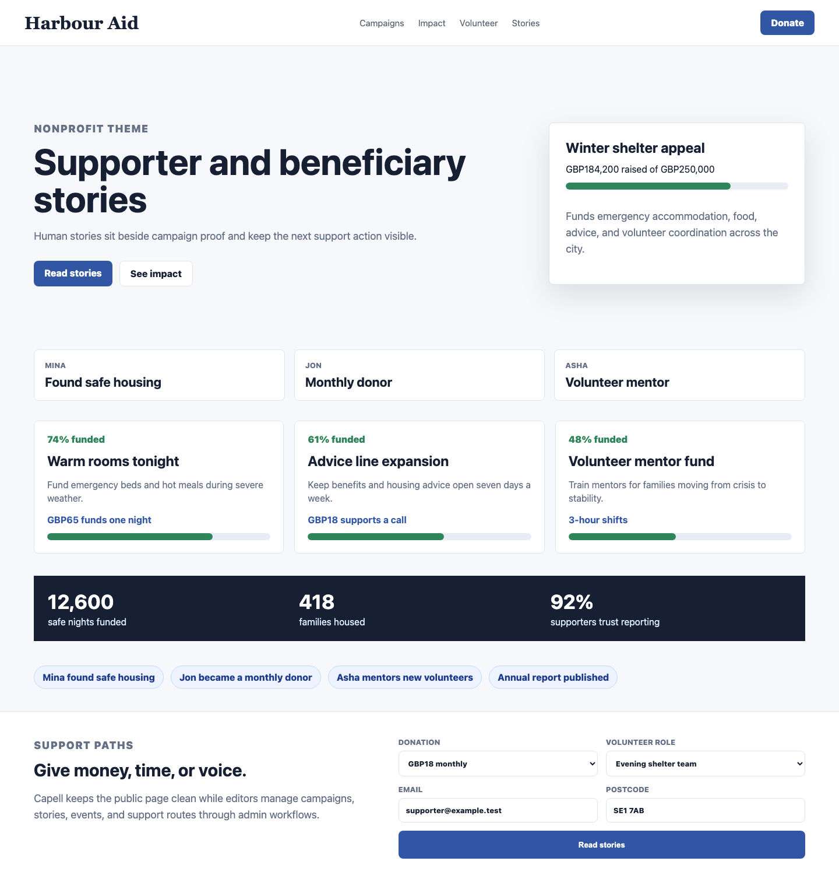
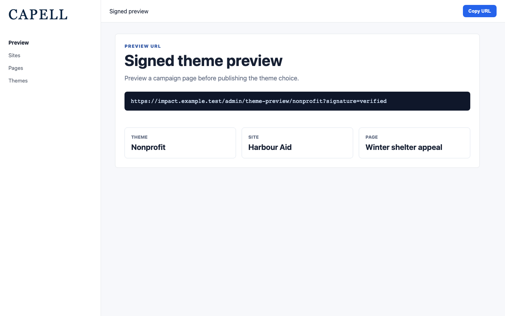

# Theme Nonprofit

<!-- prettier-ignore-start -->

## What This Plugin Adds

Theme Nonprofit is an **Available**, **No schema impact** Capell theme in the **Capell Themes** product group. It ships as `capell-app/theme-nonprofit` and extends these surfaces: frontend.

Impact-led civic and charity theme for campaigns, donations, volunteering, and community stories.

After install, admins can select the theme through the core theme management surface. Editors keep using normal Capell content workflows while the package controls public presentation.

Status details:

- Status: Available
- Tier: premium
- Bundle: themes
- Composer package: `capell-app/theme-nonprofit`
- Namespace: `Capell\ThemeStudio\Nonprofit`
- Theme key: `nonprofit`

## Why It Matters

**For developers:** The package gives developers package-owned service providers, Actions, and Blade views instead of pushing this behaviour into core or application code.

**For teams:** A premium charity, NGO, and civic theme that moves visitors from your mission to a clear support action - donate, volunteer, or follow - with impact proof, live campaign progress, and transparent annual-report sections built in.

## Screens And Workflow

Screenshot contract: `screenshots.json`.

- Theme admin list showing Nonprofit (admin, required).
- Frontend page rendered with Nonprofit theme (frontend, required).
- Nonprofit homepage (frontend, required).
- Campaigns and appeals (frontend, required).
- Impact evidence (frontend, required).
- Volunteer and donate (frontend, required).
- Community events (frontend, required).
- Supporter and beneficiary stories (frontend, required).
- Signed admin preview route (admin, required).

## Screenshot Evidence

These captures are the package-owned visual contract for the admin pages, public pages, actions, workflows, and feature surfaces described above. Keep this section aligned with `docs/screenshots.json` whenever the package surface changes.

### Theme admin list showing Nonprofit

- Surface: admin · Target: ThemeResource:index.
- Documents: An administrator confirms the Nonprofit theme is available for charity, campaign, and civic sites.
- Capture notes: Capture with Capell Frontend default theme, Layout Builder, and capell-app/theme-nonprofit installed in the isolated demo harness.

### Frontend page rendered with Nonprofit theme

- Surface: frontend · Target: /theme-nonprofit-demo.
- Documents: A charity or civic team sees how the theme moves visitors from understanding to support.
- Capture notes: Capture a seeded cause page with campaigns, impact, volunteer/donate CTA, events, stories, contact, proof, and footer.

### Nonprofit homepage

- Surface: frontend · Target: /nonprofit-homepage-layout.
- Documents: A nonprofit buyer reviews whether the first viewport creates trust and a clear support path.
- Capture notes: Capture campaign hero, impact proof, donation/volunteer actions, and a calm civic visual rhythm.

### Campaigns and appeals

- Surface: frontend · Target: /nonprofit-campaigns-layout.
- Documents: A charity checks that campaign pages are more specific than broad landing pages.
- Capture notes: Capture appeal cards, progress indicators, urgency copy, and supporter CTAs.

### Impact evidence

- Surface: frontend · Target: /nonprofit-impact-layout.
- Documents: A cause-led organisation can show outcomes without turning the theme into Corporate reporting.
- Capture notes: Capture impact metrics, evidence cards, story links, and reporting-friendly proof sections.

### Volunteer and donate

- Surface: frontend · Target: /nonprofit-volunteer-donate-layout.
- Documents: A visitor can choose a practical support route without losing the donation path.
- Capture notes: Capture parallel donation and volunteer pathways with accessible CTAs and form-builder fallback state.

### Community events

- Surface: frontend · Target: /nonprofit-events-layout.
- Documents: A civic team can promote events and volunteering opportunities with the same theme language.
- Capture notes: Capture event cards using static fallback or capell-app/events integration when installed.

### Supporter and beneficiary stories

- Surface: frontend · Target: /nonprofit-stories-layout.
- Documents: A nonprofit can use human proof without drifting into Portfolio's case-study presentation.
- Capture notes: Capture story cards, image treatment, campaign relationship, and next support actions.

### Signed admin preview route

- Surface: admin · Target: capell.admin.theme-preview.
- Documents: An administrator previews a campaign page with the Nonprofit theme applied before publishing the theme choice.
- Capture notes: Capture a signed preview URL generated for the seeded Nonprofit theme, site, and page.

## Technical Shape

- Service providers: `Capell\ThemeStudio\Nonprofit\NonprofitThemeServiceProvider`.
- Actions: `InstallNonprofitThemeDemoAction`.
- Command signatures: `capell:theme-nonprofit-demo`.
- Console command classes: `DemoCommand`.
- Manifest contributions: `admin-page: Capell\ThemeStudio\Nonprofit\Manifest\ThemeManagementPageContribution`.
- Health checks: `Capell\ThemeStudio\Nonprofit\Health\ThemeNonprofitHealthCheck`.
- Blade views: `packages/theme-nonprofit/resources/views/page.blade.php`, `packages/theme-nonprofit/resources/views/sections/annual-report-proof.blade.php`, `packages/theme-nonprofit/resources/views/sections/campaigns.blade.php`, `packages/theme-nonprofit/resources/views/sections/contact.blade.php`, `packages/theme-nonprofit/resources/views/sections/content-listing.blade.php`, `packages/theme-nonprofit/resources/views/sections/cta.blade.php`, `packages/theme-nonprofit/resources/views/sections/donation-impact.blade.php`, `packages/theme-nonprofit/resources/views/sections/events.blade.php`, `packages/theme-nonprofit/resources/views/sections/features.blade.php`, `packages/theme-nonprofit/resources/views/sections/footer.blade.php`, `packages/theme-nonprofit/resources/views/sections/hero.blade.php`, `packages/theme-nonprofit/resources/views/sections/impact.blade.php`, `and 6 more`.
- Cache tags: `theme-nonprofit`.

## Data Model

This theme has no schema impact. It relies on core Capell site, page, locale, and theme records instead of declaring package-owned tables.

## Install Impact

- Admin navigation: contributes admin extension points through `capell.json`.
- Permissions: none declared in `capell.json`.
- Public routes: none detected in package route files.
- Database changes: no package migrations declared.
- Settings: no package settings declared.
- Queues or schedules: none detected in standard package paths.
- Cache tags: `theme-nonprofit`.
- Commands: `capell:theme-nonprofit-demo`.

## Common Pitfalls

- Keep public Blade and cached HTML free of authoring markers, model IDs, permissions, signed editor URLs, and lazy database queries.
- Keep `composer.json`, `composer.local.json`, `capell.json`, docs, screenshots, and tests aligned when the package surface changes.

## Troubleshooting

| Symptom | Likely cause | Check | Fix |
| --- | --- | --- | --- |
| Package surface is missing after install | Provider or manifest is not loaded | Confirm `capell.json`, package `composer.json`, and provider registration | Reinstall the package, refresh Composer autoload, and clear host caches |
| Background work does not run | Queue worker or scheduled command is not active | Check package jobs, commands, and host scheduler configuration | Start the queue or scheduler, then run the focused command or package test |
| Public output leaks unexpected state | Render data, cache variation, or authoring boundary has regressed | Check public Blade, cache tags, and public-output safety tests | Move data loading out of Blade and rerun the package public-output tests |

## Quick Start

1. Install the package: `composer require capell-app/theme-nonprofit`.
2. Run the required setup: `php artisan capell:theme-nonprofit-demo`.
3. Verify the package provider is registered and the related frontend, command, or extension point is active.

## Next Steps

- [Package docs index](README.md)
- [Screenshot contract](screenshots.json)
- [Marketplace assets](assets/marketplace/)
- [Capell content language plan](../../../docs/CONTENT_LANGUAGE_PLAN.md)
- [Capell documentation design system](../../../docs/DESIGN_SYSTEM.md)
- [Capell and package ERD notes](../../../docs/erd/capell-and-package-erds.md)
- Related packages: [Layout Builder](../../layout-builder/README.md), [Frontend Authoring](../../frontend-authoring/README.md), [Publishing Studio](../../publishing-studio/README.md), [Seo Suite](../../seo-suite/README.md), [Blog](../../blog/README.md).
- Focused tests: `vendor/bin/pest packages/theme-nonprofit/tests --configuration=phpunit.xml`.

<!-- prettier-ignore-end -->
