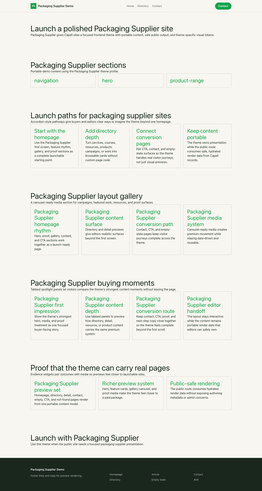
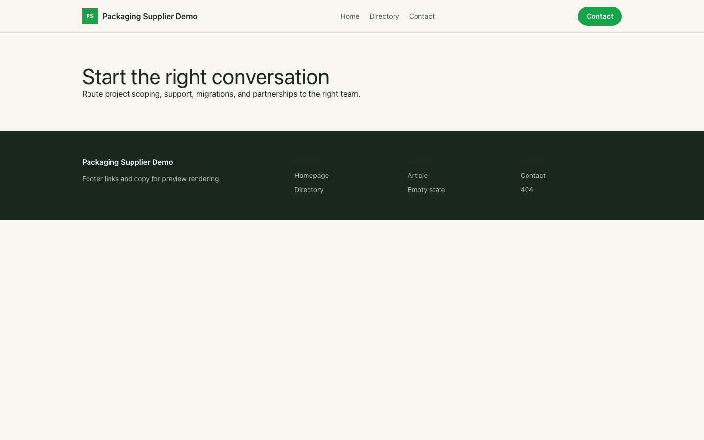

# Theme Packaging Supplier

Packaging Supplier provides a distinct Capell frontend theme for Verda Packaging. From the repository root, run `vendor/bin/pest packages/theme-packaging-supplier/tests`; this package does not ship its own PHPUnit config.

## Screenshot Evidence

These captures are the package-owned visual contract for the admin pages, public pages, actions, workflows, and feature surfaces described above. Keep this section aligned with `docs/screenshots.json` whenever the package surface changes.

### Packaging Supplier Homepage

- Surface: frontend · Target: /.
- Documents: Theme marketplace preview.
- Capture notes: Packaging Supplier Homepage.

### Packaging Supplier Landing page

- Surface: frontend · Target: /.
- Documents: Theme marketplace preview.
- Capture notes: Packaging Supplier Landing page.

### Packaging Supplier List page

- Surface: frontend · Target: /.
- Documents: Theme marketplace preview.
- Capture notes: Packaging Supplier List page.

### Packaging Supplier Search results

- Surface: frontend · Target: /.
- Documents: Theme marketplace preview.
- Capture notes: Packaging Supplier Search results.

### Packaging Supplier Contact form

- Surface: frontend · Target: /.
- Documents: Theme marketplace preview.
- Capture notes: Packaging Supplier Contact form.
