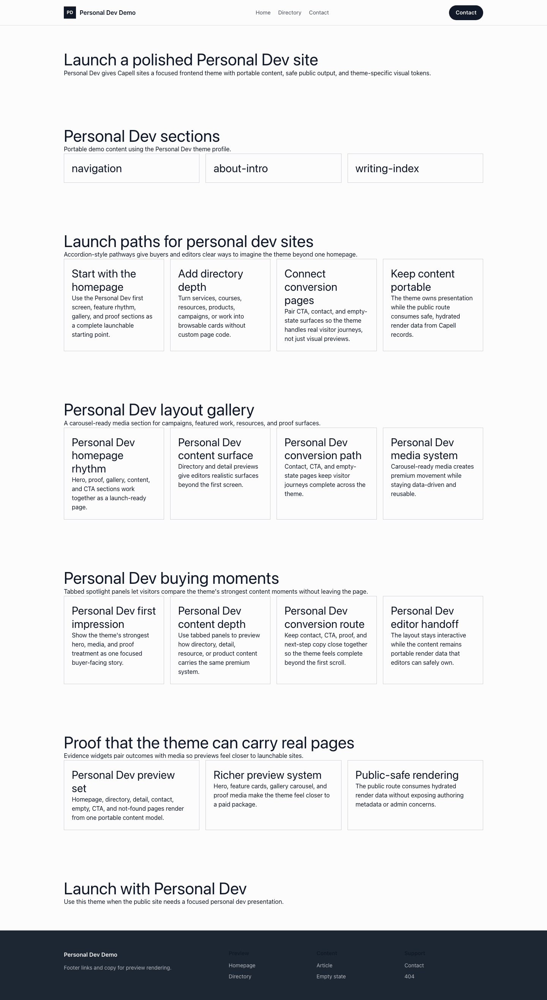

# Theme Personal Dev

Personal Dev provides a distinct Capell frontend theme for Jonah Vance. From the repository root, run `vendor/bin/pest packages/theme-personal-dev/tests`; this package does not ship its own PHPUnit config.

## Screenshot Evidence

These captures are the package-owned visual contract for the admin pages, public pages, actions, workflows, and feature surfaces described above. Keep this section aligned with `docs/screenshots.json` whenever the package surface changes.

### Personal Dev Homepage

- Surface: frontend · Target: /.
- Documents: Theme marketplace preview.
- Capture notes: Personal Dev Homepage.

### Personal Dev Landing page

- Surface: frontend · Target: /.
- Documents: Theme marketplace preview.
- Capture notes: Personal Dev Landing page.

### Personal Dev List page

- Surface: frontend · Target: /.
- Documents: Theme marketplace preview.
- Capture notes: Personal Dev List page.

### Personal Dev Search results

- Surface: frontend · Target: /.
- Documents: Theme marketplace preview.
- Capture notes: Personal Dev Search results.

### Personal Dev Contact form

- Surface: frontend · Target: /.
- Documents: Theme marketplace preview.
- Capture notes: Personal Dev Contact form.
