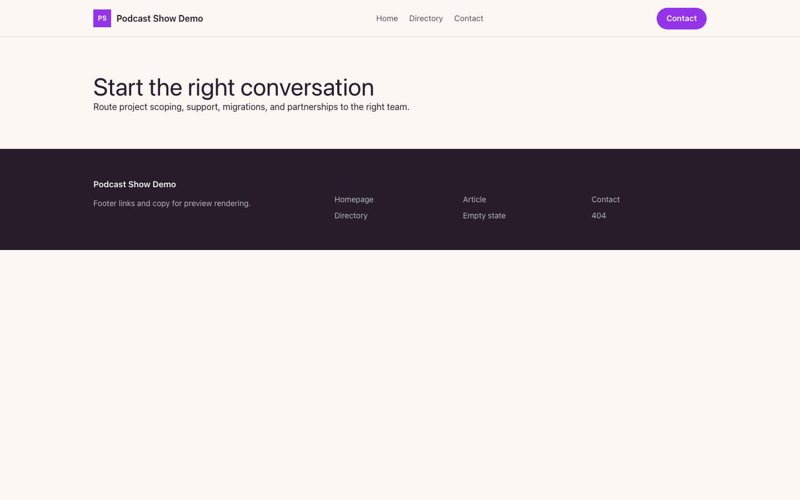

# Theme Podcast Show

Podcast Show provides a distinct Capell frontend theme for Signal & Noise. From the repository root, run `vendor/bin/pest packages/theme-podcast-show/tests`; this package does not ship its own PHPUnit config.

## Screenshot Evidence

These captures are the package-owned visual contract for the admin pages, public pages, actions, workflows, and feature surfaces described above. Keep this section aligned with `docs/screenshots.json` whenever the package surface changes.

### Podcast Show Homepage

- Surface: frontend · Target: /.
- Documents: Theme marketplace preview.
- Capture notes: Podcast Show Homepage.

### Podcast Show Landing page

- Surface: frontend · Target: /.
- Documents: Theme marketplace preview.
- Capture notes: Podcast Show Landing page.

### Podcast Show List page

- Surface: frontend · Target: /.
- Documents: Theme marketplace preview.
- Capture notes: Podcast Show List page.

### Podcast Show Search results

- Surface: frontend · Target: /.
- Documents: Theme marketplace preview.
- Capture notes: Podcast Show Search results.

### Podcast Show Contact form

- Surface: frontend · Target: /.
- Documents: Theme marketplace preview.
- Capture notes: Podcast Show Contact form.
