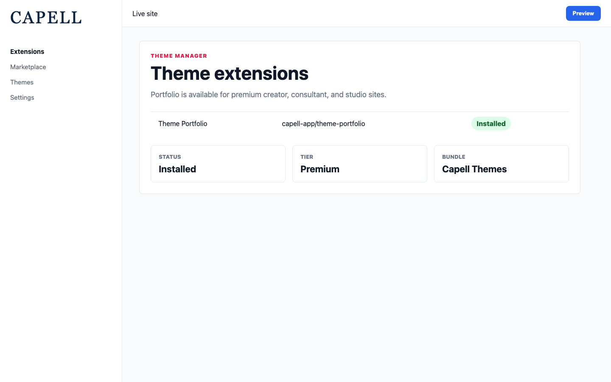
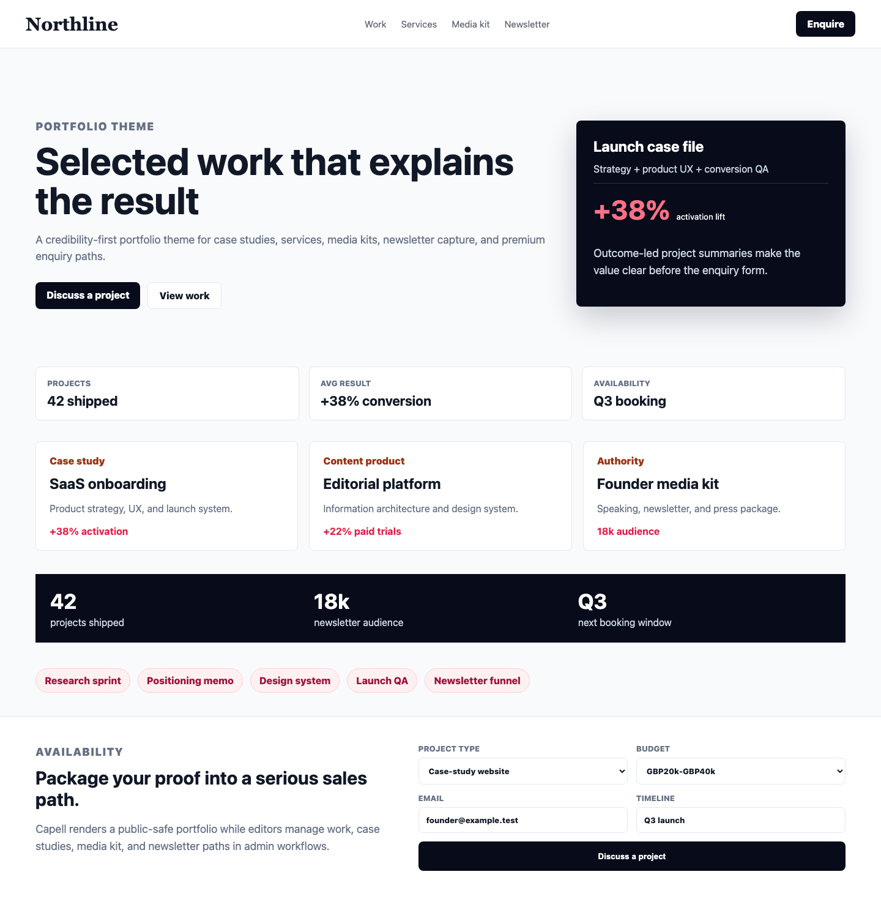
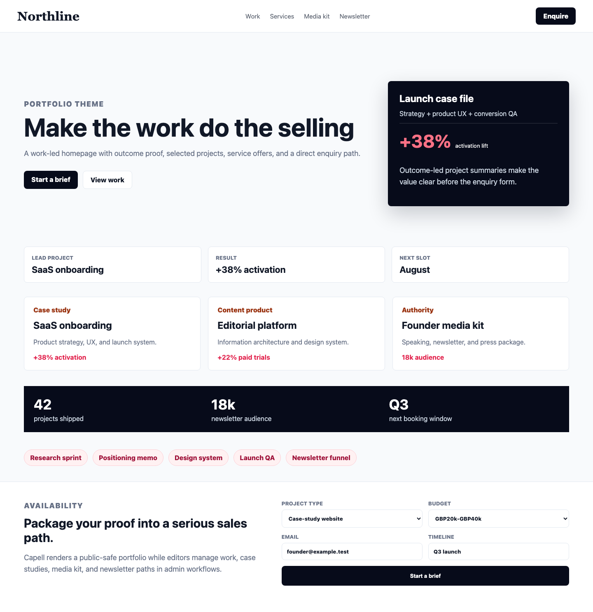
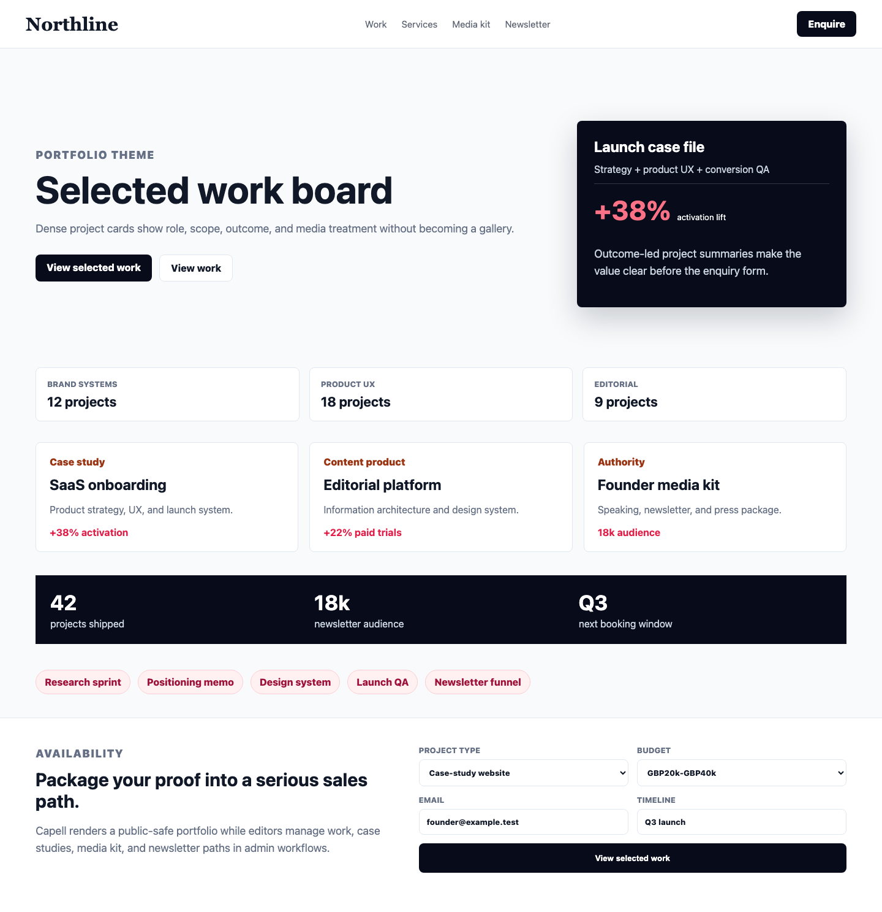
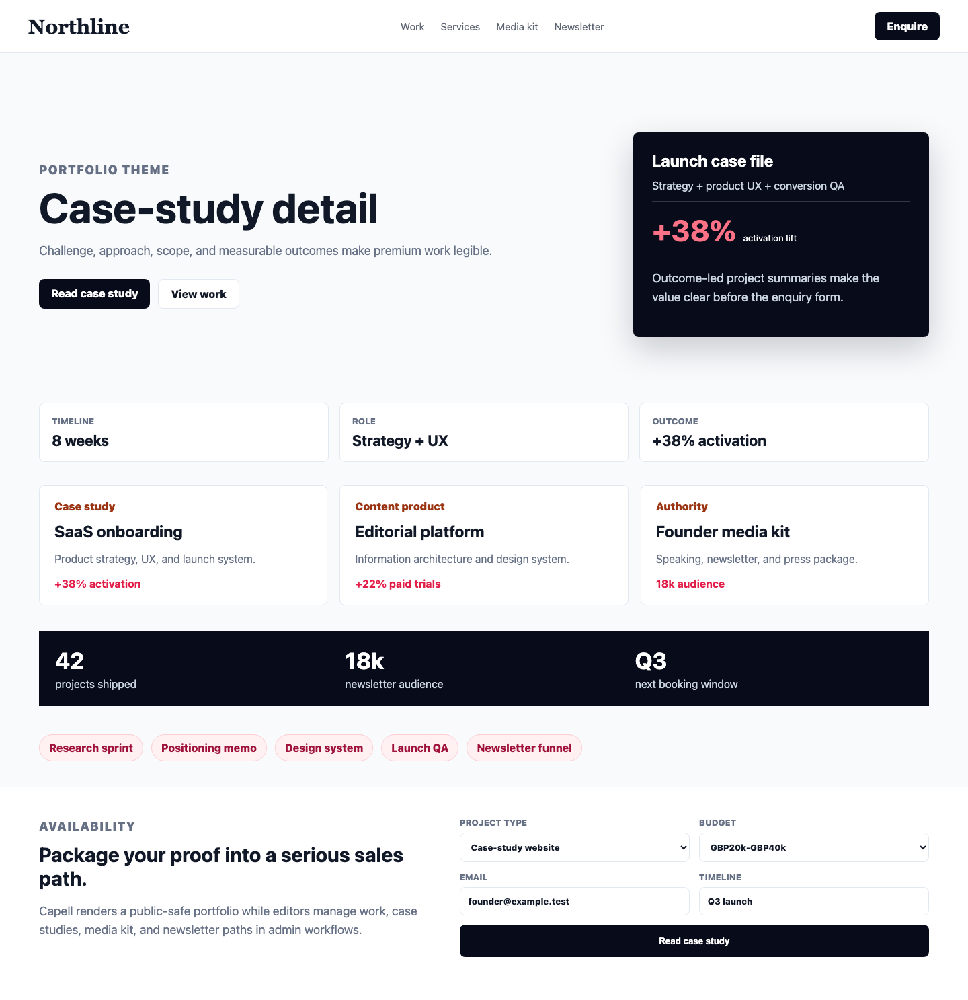
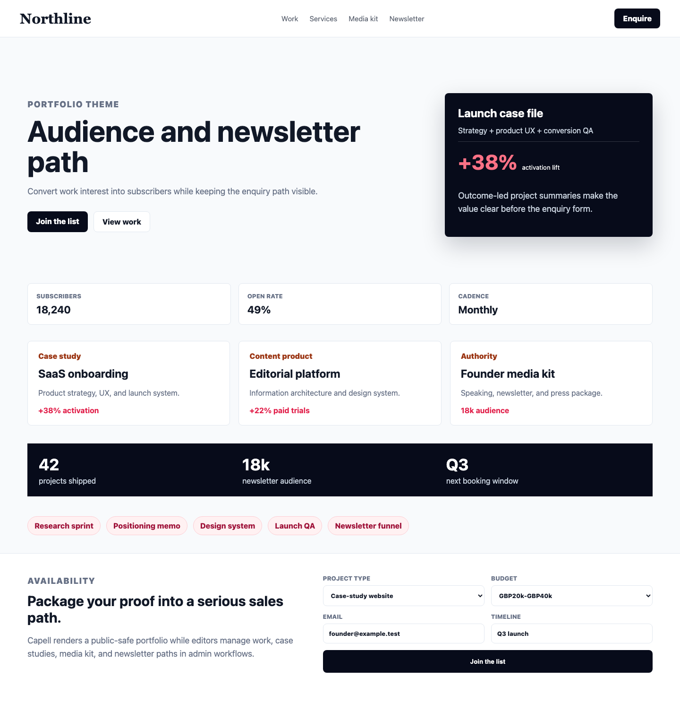
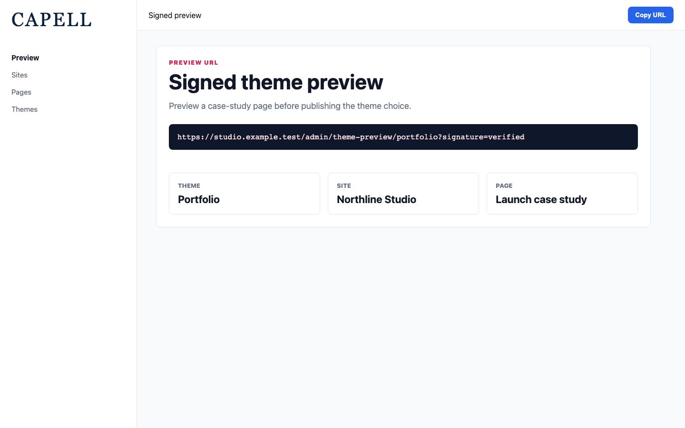

# Theme Portfolio

<!-- prettier-ignore-start -->

## What This Plugin Adds

Theme Portfolio is an **Available**, **No schema impact** Capell theme in the **Capell Themes** product group. It ships as `capell-app/theme-portfolio` and extends these surfaces: frontend.

Creator and consultant portfolio theme for work, case studies, services, media kits, and newsletters.

After install, admins can select the theme through the core theme management surface. Editors keep using normal Capell content workflows while the package controls public presentation.

Status details:

- Status: Available
- Tier: premium
- Bundle: themes
- Composer package: `capell-app/theme-portfolio`
- Namespace: `Capell\ThemeStudio\Portfolio`
- Theme key: `portfolio`

## Why It Matters

**For developers:** The package gives developers package-owned service providers, Actions, and Blade views instead of pushing this behaviour into core or application code.

**For teams:** A premium portfolio theme for creators and consultants - turn selected work into outcome-driven case studies, sell your services and media kit, and grow your audience from one polished site.

## Screens And Workflow

Screenshot contract: `screenshots.json`.

- Theme admin list showing Portfolio (admin, required).
- Frontend page rendered with Portfolio theme (frontend, required).
- Portfolio homepage (frontend, required).
- Selected work board (frontend, required).
- Case-study detail (frontend, required).
- Studio capabilities (frontend, required).
- Media kit and speaking package (frontend, required).
- Audience and newsletter path (frontend, required).
- Signed admin preview route (admin, required).

## Screenshot Evidence

These captures are the package-owned visual contract for the admin pages, public pages, actions, workflows, and feature surfaces described above. Keep this section aligned with `docs/screenshots.json` whenever the package surface changes.

### Theme admin list showing Portfolio

- Surface: admin · Target: ThemeResource:index.
- Documents: An administrator confirms the Portfolio theme is available for a premium studio or case-study site.
- Capture notes: Capture with Capell Frontend default theme, Layout Builder, and capell-app/theme-portfolio installed in the isolated demo harness.

### Frontend page rendered with Portfolio theme

- Surface: frontend · Target: /theme-portfolio-demo.
- Documents: A studio, consultant, or creator sees how the theme sells work outcomes without overlapping Agency's campaign preset.
- Capture notes: Capture a seeded studio page with work grid, case studies, services, proof, testimonials, media kit, newsletter, CTA, and footer.

### Portfolio homepage

- Surface: frontend · Target: /portfolio-homepage-layout.
- Documents: A premium studio reviews whether the first viewport feels like a serious case-study product rather than a basic creative preset.
- Capture notes: Capture work-led hero, case-file proof, selected work, audience path, and enquiry CTA.

### Selected work board

- Surface: frontend · Target: /portfolio-work-grid-layout.
- Documents: A visitor can scan relevant work without the theme feeling like a blog, gallery, or Agency services grid.
- Capture notes: Capture dense work cards with media treatment, role/scope metadata, outcome labels, and filtering rhythm.

### Case-study detail

- Surface: frontend · Target: /portfolio-case-study-layout.
- Documents: A studio proves premium value through measurable work outcomes instead of broad testimonials.
- Capture notes: Capture outcome ledger, challenge/approach/result sections, scope cards, and next-project CTA.

### Studio capabilities

- Surface: frontend · Target: /portfolio-services-layout.
- Documents: A visitor understands what can be bought without the theme becoming a local-services page.
- Capture notes: Capture studio service cards, engagement shape, process hints, and proof-linked capabilities.

### Media kit and speaking package

- Surface: frontend · Target: /portfolio-media-kit-layout.
- Documents: A creator or consultant can sell authority and audience-building without needing a separate knowledge theme.
- Capture notes: Capture speaking, press, audience, and newsletter paths with compact credibility proof.

### Audience and newsletter path

- Surface: frontend · Target: /portfolio-newsletter-layout.
- Documents: A studio checks that audience growth supports the portfolio lane without becoming Knowledge's resource archive.
- Capture notes: Capture newsletter CTA, audience proof, and work-to-subscriber conversion copy.

### Signed admin preview route

- Surface: admin · Target: capell.admin.theme-preview.
- Documents: An administrator previews a case-study page with the Portfolio theme applied before publishing the theme choice.
- Capture notes: Capture a signed preview URL generated for the seeded Portfolio theme, site, and page.

## Technical Shape

- Service providers: `Capell\ThemeStudio\Portfolio\PortfolioThemeServiceProvider`.
- Actions: `InstallPortfolioThemeDemoAction`.
- Command signatures: `capell:theme-portfolio-demo`.
- Console command classes: `DemoCommand`.
- Manifest contributions: `admin-page: Capell\ThemeStudio\Portfolio\Manifest\ThemeManagementPageContribution`.
- Health checks: `Capell\ThemeStudio\Portfolio\Health\ThemePortfolioHealthCheck`.
- Blade views: `packages/theme-portfolio/resources/views/page.blade.php`, `packages/theme-portfolio/resources/views/sections/about-bio.blade.php`, `packages/theme-portfolio/resources/views/sections/availability.blade.php`, `packages/theme-portfolio/resources/views/sections/case-studies.blade.php`, `packages/theme-portfolio/resources/views/sections/case-study-detail.blade.php`, `packages/theme-portfolio/resources/views/sections/client-logos.blade.php`, `packages/theme-portfolio/resources/views/sections/content-listing.blade.php`, `packages/theme-portfolio/resources/views/sections/cta.blade.php`, `packages/theme-portfolio/resources/views/sections/features.blade.php`, `packages/theme-portfolio/resources/views/sections/footer.blade.php`, `packages/theme-portfolio/resources/views/sections/gallery-lightbox.blade.php`, `packages/theme-portfolio/resources/views/sections/hero.blade.php`, `and 9 more`.
- Cache tags: `theme-portfolio`.

## Theme Inheritance Contract

Product group:
**Capell Themes**

- Product group: `Capell Themes`
- Manifest extends: `default`
- Runtime extends: `default`
- Portfolio runtime inheritance uses `extends: default` and requires `capell-app/frontend` for the built-in default fallback.

## Data Model

This theme has no schema impact. It relies on core Capell site, page, locale, and theme records instead of declaring package-owned tables.

## Install Impact

- Admin navigation: contributes admin extension points through `capell.json`.
- Permissions: none declared in `capell.json`.
- Public routes: none detected in package route files.
- Database changes: no package migrations declared.
- Settings: no package settings declared.
- Queues or schedules: none detected in standard package paths.
- Cache tags: `theme-portfolio`.
- Commands: `capell:theme-portfolio-demo`.

## Common Pitfalls

- Keep public Blade and cached HTML free of authoring markers, model IDs, permissions, signed editor URLs, and lazy database queries.
- Keep `composer.json`, `composer.local.json`, `capell.json`, docs, screenshots, and tests aligned when the package surface changes.

## Troubleshooting

| Symptom | Likely cause | Check | Fix |
| --- | --- | --- | --- |
| Package surface is missing after install | Provider or manifest is not loaded | Confirm `capell.json`, package `composer.json`, and provider registration | Reinstall the package, refresh Composer autoload, and clear host caches |
| Background work does not run | Queue worker or scheduled command is not active | Check package jobs, commands, and host scheduler configuration | Start the queue or scheduler, then run the focused command or package test |
| Public output leaks unexpected state | Render data, cache variation, or authoring boundary has regressed | Check public Blade, cache tags, and public-output safety tests | Move data loading out of Blade and rerun the package public-output tests |

## Quick Start

1. Install the package: `composer require capell-app/theme-portfolio`.
2. Run the required setup: `php artisan capell:theme-portfolio-demo`.
3. Verify the package provider is registered and the related frontend, command, or extension point is active.

## Next Steps

- [Package docs index](README.md)
- [Screenshot contract](screenshots.json)
- [Marketplace assets](assets/marketplace/)
- [Capell content language plan](../../../docs/CONTENT_LANGUAGE_PLAN.md)
- [Capell documentation design system](../../../docs/DESIGN_SYSTEM.md)
- [Capell and package ERD notes](../../../docs/erd/capell-and-package-erds.md)
- Related packages: [Layout Builder](../../layout-builder/README.md), [Frontend Authoring](../../frontend-authoring/README.md), [Publishing Studio](../../publishing-studio/README.md), [Seo Suite](../../seo-suite/README.md), [Blog](../../blog/README.md).
- Focused tests: `vendor/bin/pest packages/theme-portfolio/tests --configuration=phpunit.xml`.

<!-- prettier-ignore-end -->
