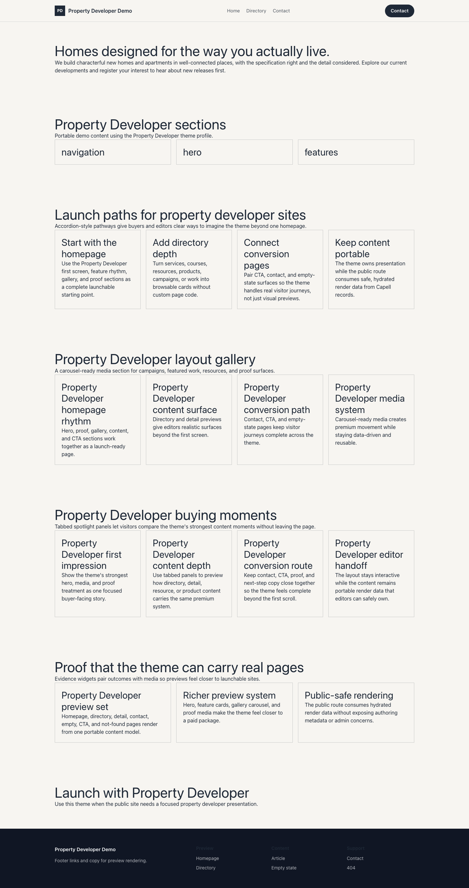

# Theme Property Developer

Property Developer provides a distinct Capell frontend theme for Crestwood Developments. From the repository root, run `vendor/bin/pest packages/theme-property-developer/tests`; this package does not ship its own PHPUnit config.

## Screenshot Evidence

These captures are the package-owned visual contract for the admin pages, public pages, actions, workflows, and feature surfaces described above. Keep this section aligned with `docs/screenshots.json` whenever the package surface changes.

### Property Developer Homepage

- Surface: frontend · Target: /.
- Documents: Theme marketplace preview.
- Capture notes: Property Developer Homepage.

### Property Developer Landing page

- Surface: frontend · Target: /.
- Documents: Theme marketplace preview.
- Capture notes: Property Developer Landing page.

### Property Developer List page

- Surface: frontend · Target: /.
- Documents: Theme marketplace preview.
- Capture notes: Property Developer List page.

### Property Developer Search results

- Surface: frontend · Target: /.
- Documents: Theme marketplace preview.
- Capture notes: Property Developer Search results.

### Property Developer Contact form

- Surface: frontend · Target: /.
- Documents: Theme marketplace preview.
- Capture notes: Property Developer Contact form.
