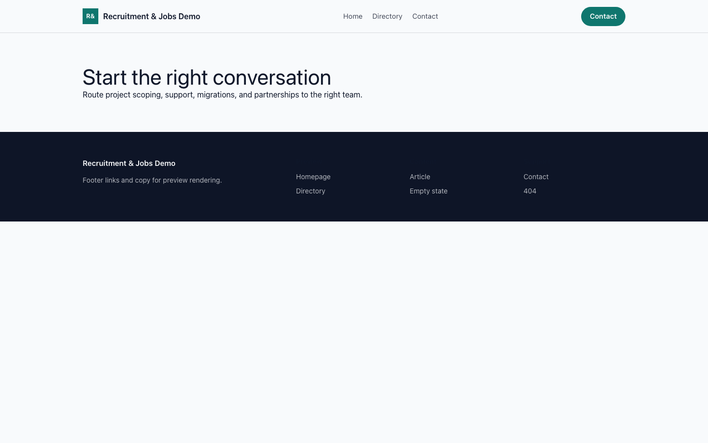

# Theme Recruitment & Jobs

Recruitment & Jobs provides a distinct Capell frontend theme for Beacon Talent. From the repository root, run `vendor/bin/pest packages/theme-recruitment-jobs/tests`; this package does not ship its own PHPUnit config.

## Screenshot Evidence

These captures are the package-owned visual contract for the admin pages, public pages, actions, workflows, and feature surfaces described above. Keep this section aligned with `docs/screenshots.json` whenever the package surface changes.

### Recruitment & Jobs Homepage

- Surface: frontend · Target: /.
- Documents: Theme marketplace preview.
- Capture notes: Recruitment & Jobs Homepage.

### Recruitment & Jobs Landing page

- Surface: frontend · Target: /.
- Documents: Theme marketplace preview.
- Capture notes: Recruitment & Jobs Landing page.

### Recruitment & Jobs List page

- Surface: frontend · Target: /.
- Documents: Theme marketplace preview.
- Capture notes: Recruitment & Jobs List page.

### Recruitment & Jobs Search results

- Surface: frontend · Target: /.
- Documents: Theme marketplace preview.
- Capture notes: Recruitment & Jobs Search results.

### Recruitment & Jobs Contact form

- Surface: frontend · Target: /.
- Documents: Theme marketplace preview.
- Capture notes: Recruitment & Jobs Contact form.
