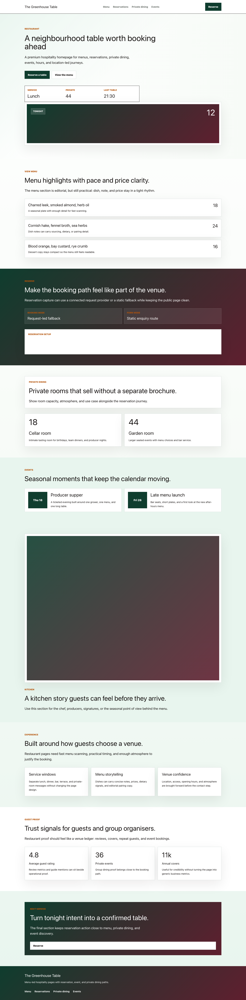
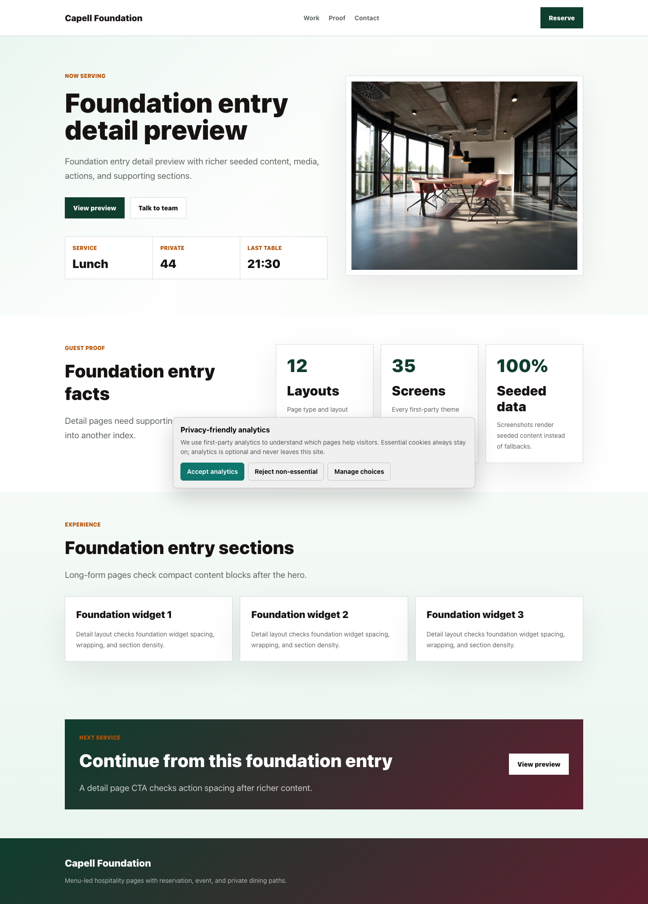
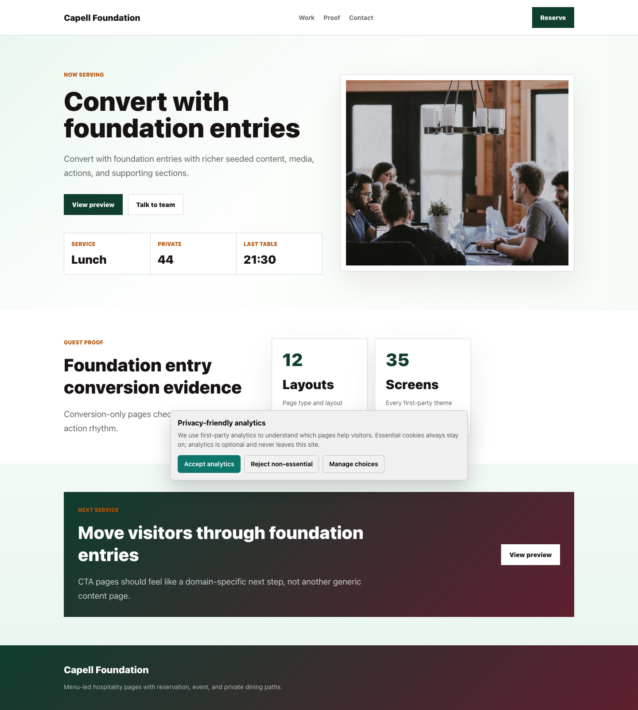
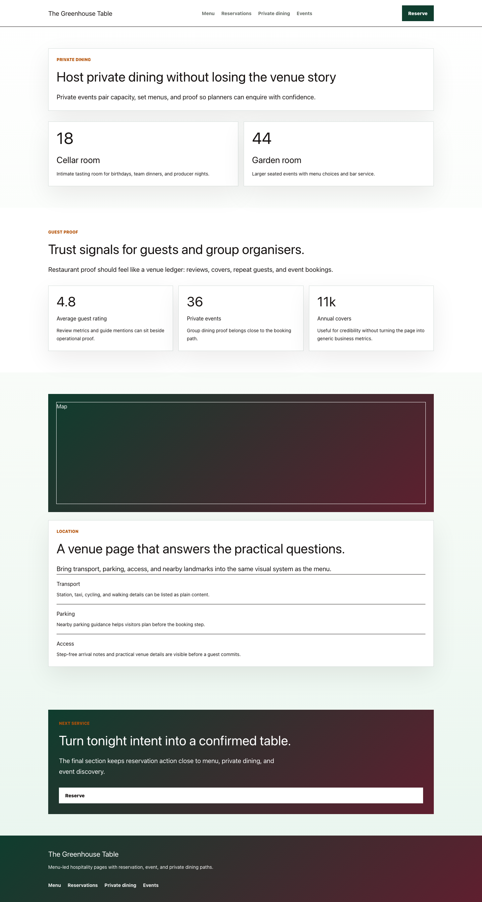
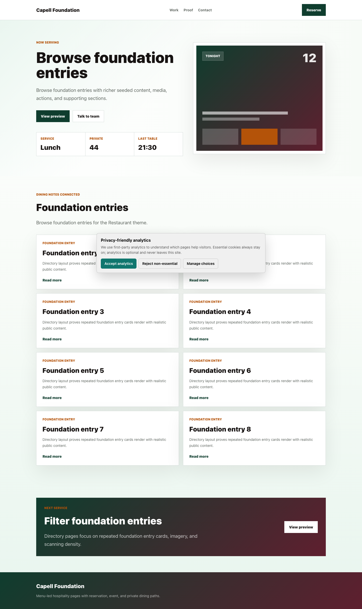

# Theme Restaurant

<!-- prettier-ignore-start -->

## What This Plugin Adds

Theme Restaurant is an **Available**, **No schema impact** Capell theme in the **Capell Themes** product group. It ships as `capell-app/theme-restaurant` and extends these surfaces: frontend, console.

Theme Restaurant gives hospitality teams a premium venue website built around menu discovery, reservation intent, private dining, events, opening hours, and location confidence. It extends the built-in default frontend theme, keeps restaurant copy and menu items in portable Capell content, and lets the package own the visual rhythm: editorial menu panels, service windows, private-room selling, event previews, and map-adjacent venue proof. It pairs with Bookings or Form Builder for reservation capture, Events for ticketed or seasonal occasions, and Blog for reviews or dining guides while rendering safe static fallbacks when those packages are absent.

After install, admins can select the theme through the core theme management surface. Editors keep using normal Capell content workflows while the package controls public presentation.

Status details:

- Status: Available
- Tier: premium
- Bundle: themes
- Composer package: `capell-app/theme-restaurant`
- Namespace: `Capell\ThemeStudio\Restaurant`
- Theme key: `restaurant`

## Why It Matters

**For developers:** The package gives developers package-owned service providers, Actions, and Blade views instead of pushing this behaviour into core or application code.

**For teams:** A premium hospitality theme for menu-led restaurants, bars, private dining venues, and event-led dining businesses.

## Screens And Workflow

Screenshot contract: `screenshots.json`.

- Restaurant homepage (frontend, optional).
- Menu highlights (frontend, optional).
- Reservation panel (frontend, optional).
- Private dining (frontend, optional).
- Restaurant events (frontend, optional).

## Screenshot Evidence

These captures are the package-owned visual contract for the admin pages, public pages, actions, workflows, and feature surfaces described above. Keep this section aligned with `docs/screenshots.json` whenever the package surface changes.

### Restaurant homepage

- Surface: frontend · Target: /theme-restaurant.
- Documents: A restaurant reviews the first viewport and booking path before activating the premium theme.
- Capture notes: Committed route-rendered restaurant homepage fixture with menu, reservation, private dining, events, and proof sections.

### Menu highlights

- Surface: frontend · Target: /theme-restaurant-menu.
- Documents: A hospitality team checks that menus are scannable and premium without storing presentation markup.
- Capture notes: Committed route-rendered menu/detail fixture with editorial dish content.

### Reservation panel

- Surface: frontend · Target: /theme-restaurant-reservations.
- Documents: A restaurant confirms the booking path feels like part of the venue experience.
- Capture notes: Committed route-rendered reservation CTA fixture proving non-submitting fallback states.

### Private dining

- Surface: frontend · Target: /theme-restaurant-private-dining.
- Documents: A venue validates that private dining feels like a premium conversion path.
- Capture notes: Committed route-rendered visual review fixture covering private dining and premium venue sections.

### Restaurant events

- Surface: frontend · Target: /theme-restaurant-events.
- Documents: A venue checks that event content is promoted without turning the theme into an events package.
- Capture notes: Committed route-rendered directory/events fixture covering seasonal listings.

## Technical Shape

- Service providers: `Capell\ThemeStudio\Restaurant\RestaurantThemeServiceProvider`.
- Actions: `InstallRestaurantThemeDemoAction`.
- Command signatures: `capell:theme-restaurant-demo`.
- Console command classes: `DemoCommand`.
- Manifest contributions: `admin-page: Capell\ThemeStudio\Restaurant\Manifest\ThemeManagementPageContribution`.
- Health checks: `Capell\ThemeStudio\Restaurant\Health\ThemeRestaurantHealthCheck`.
- Blade views: `packages/theme-restaurant/resources/views/page.blade.php`, `packages/theme-restaurant/resources/views/sections/chef-story.blade.php`, `packages/theme-restaurant/resources/views/sections/content-listing.blade.php`, `packages/theme-restaurant/resources/views/sections/cta.blade.php`, `packages/theme-restaurant/resources/views/sections/events-calendar.blade.php`, `packages/theme-restaurant/resources/views/sections/features.blade.php`, `packages/theme-restaurant/resources/views/sections/footer.blade.php`, `packages/theme-restaurant/resources/views/sections/hero.blade.php`, `packages/theme-restaurant/resources/views/sections/location-guide.blade.php`, `packages/theme-restaurant/resources/views/sections/menu-highlights.blade.php`, `packages/theme-restaurant/resources/views/sections/navigation.blade.php`, `packages/theme-restaurant/resources/views/sections/opening-hours.blade.php`, `and 3 more`.
- Cache tags: `theme-restaurant`.

## Theme Inheritance Contract

Product group:
**Capell Themes**

- Product group: `Capell Themes`
- Manifest extends: `default`
- Runtime extends: `default`
- Restaurant runtime inheritance uses `extends: default` and requires `capell-app/foundation-theme` plus `capell-app/frontend` for Foundation Theme rendering and public frontend output.

## Integration Contract

Reservation capture stays in hydrated render data. Pass a public `form_action` URL from Bookings, Form Builder, or host application code to render the reservation form. When no safe action is supplied, the reservation panel renders a non-submitting setup state instead of a fake form target.

Restaurant sections do not query Bookings, Form Builder, Events, Blog, or SEO Suite directly. Host controllers, page payload builders, theme composers, or companion package adapters must hydrate public-safe arrays for reservation actions, event cards, listing items, opening hours, menu highlights, and local proof before Blade renders.

## Cacheability

Theme Restaurant output is cacheable for public HTML because package Blade is query-free, secret-free, and authoring-free. Cache entries vary by site and locale. Invalidation should be driven by the host content/theme pipeline when site, page, theme, menu, reservation, event, blog/listing, or other hydrated render data changes; this theme does not queue package-owned invalidation work.

## Data Model

This theme has no schema impact. It relies on core Capell site, page, locale, and theme records instead of declaring package-owned tables.

## Install Impact

- Admin navigation: contributes admin extension points through `capell.json`.
- Permissions: none declared in `capell.json`.
- Public routes: none detected in package route files.
- Database changes: no package migrations declared.
- Settings: no package settings declared.
- Queues or schedules: none detected in standard package paths.
- Cache tags: `theme-restaurant`; public output varies by site and locale.
- Commands: `capell:theme-restaurant-demo`.

## Common Pitfalls

- Keep public Blade and cached HTML free of authoring markers, model IDs, permissions, signed editor URLs, and lazy database queries.
- Run package commands from the host app; in this repository use `vendor/bin/pest` for package tests.
- Keep `composer.json`, `composer.local.json`, `capell.json`, docs, screenshots, and tests aligned when the package surface changes.

## Troubleshooting

| Symptom | Likely cause | Check | Fix |
| --- | --- | --- | --- |
| Package surface is missing after install | Provider or manifest is not loaded | Confirm `capell.json`, package `composer.json`, and provider registration | Reinstall the package, refresh Composer autoload, and clear host caches |
| Background work does not run | Queue worker or scheduled command is not active | Check package jobs, commands, and host scheduler configuration | Start the queue or scheduler, then run the focused command or package test |
| Public output leaks unexpected state | Render data, cache variation, or authoring boundary has regressed | Check public Blade, cache tags, and public-output safety tests | Move data loading out of Blade and rerun the package public-output tests |

## Quick Start

In a host Capell app, install the package with its Foundation Theme dependency using `composer require capell-app/foundation-theme capell-app/theme-restaurant`.

Then run the optional demo command from the host app, not from this package monorepo: `php artisan capell:theme-restaurant-demo`.

For package development in this repository, use package-local Pest commands such as `vendor/bin/pest packages/theme-restaurant/tests --configuration=phpunit.xml`.

## Next Steps

- [Package docs index](README.md)
- [Screenshot contract](screenshots.json)
- [Marketplace assets](assets/marketplace/)
- [Capell content language plan](../../../docs/CONTENT_LANGUAGE_PLAN.md)
- [Capell documentation design system](../../../docs/DESIGN_SYSTEM.md)
- [Capell and package ERD notes](../../../docs/erd/capell-and-package-erds.md)
- Related packages: [Foundation Theme](../../foundation-theme/README.md), [Blog](../../blog/README.md), [Bookings](../../bookings/README.md), [Events](../../events/README.md), [Form Builder](../../form-builder/README.md), [Seo Suite](../../seo-suite/README.md).
- Focused tests: `vendor/bin/pest packages/theme-restaurant/tests --configuration=phpunit.xml`.

<!-- prettier-ignore-end -->
