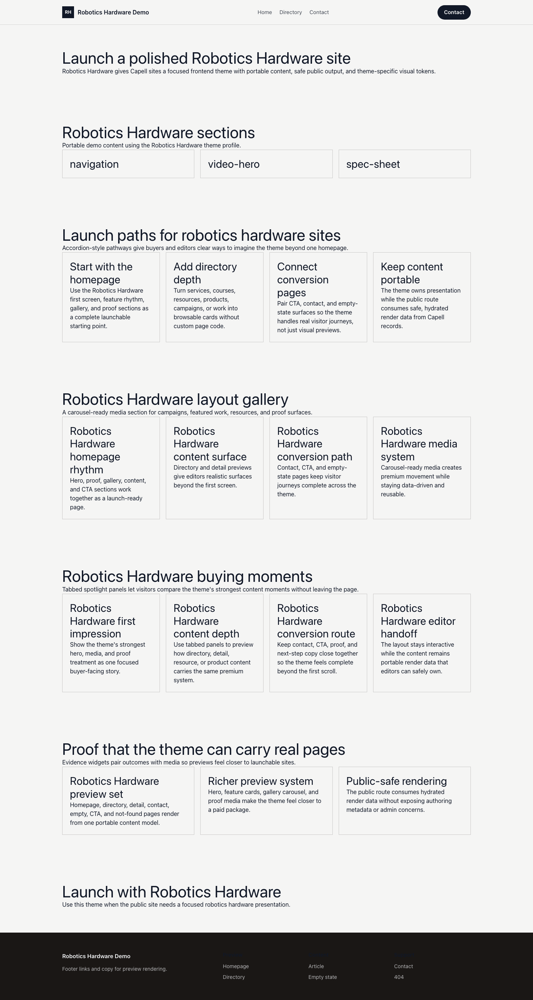

# Theme Robotics Hardware

Robotics Hardware provides a distinct Capell frontend theme for Atelier One. From the repository root, run `vendor/bin/pest packages/theme-robotics-hardware/tests`; this package does not ship its own PHPUnit config.

## Screenshot Evidence

These captures are the package-owned visual contract for the admin pages, public pages, actions, workflows, and feature surfaces described above. Keep this section aligned with `docs/screenshots.json` whenever the package surface changes.

### Robotics Hardware Homepage

- Surface: frontend · Target: /.
- Documents: Theme marketplace preview.
- Capture notes: Robotics Hardware Homepage.

### Robotics Hardware Landing page

- Surface: frontend · Target: /.
- Documents: Theme marketplace preview.
- Capture notes: Robotics Hardware Landing page.

### Robotics Hardware List page

- Surface: frontend · Target: /.
- Documents: Theme marketplace preview.
- Capture notes: Robotics Hardware List page.

### Robotics Hardware Search results

- Surface: frontend · Target: /.
- Documents: Theme marketplace preview.
- Capture notes: Robotics Hardware Search results.

### Robotics Hardware Contact form

- Surface: frontend · Target: /.
- Documents: Theme marketplace preview.
- Capture notes: Robotics Hardware Contact form.
