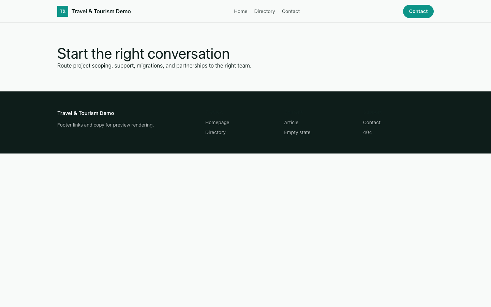

# Theme Travel & Tourism

Travel & Tourism provides a distinct Capell frontend theme for Meridian Travel. From the repository root, run `vendor/bin/pest packages/theme-travel-tourism/tests`; this package does not ship its own PHPUnit config.

## Screenshot Evidence

These captures are the package-owned visual contract for the admin pages, public pages, actions, workflows, and feature surfaces described above. Keep this section aligned with `docs/screenshots.json` whenever the package surface changes.

### Travel & Tourism Homepage

- Surface: frontend · Target: /.
- Documents: Theme marketplace preview.
- Capture notes: Travel & Tourism Homepage.

### Travel & Tourism Landing page

- Surface: frontend · Target: /.
- Documents: Theme marketplace preview.
- Capture notes: Travel & Tourism Landing page.

### Travel & Tourism List page

- Surface: frontend · Target: /.
- Documents: Theme marketplace preview.
- Capture notes: Travel & Tourism List page.

### Travel & Tourism Search results

- Surface: frontend · Target: /.
- Documents: Theme marketplace preview.
- Capture notes: Travel & Tourism Search results.

### Travel & Tourism Contact form

- Surface: frontend · Target: /.
- Documents: Theme marketplace preview.
- Capture notes: Travel & Tourism Contact form.
